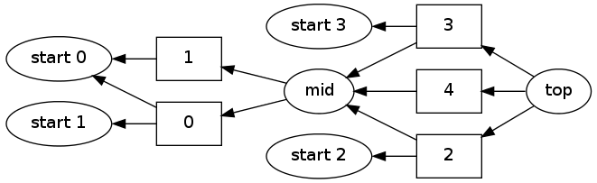

.. code:: python

    import pydecode.test.utils as utils
    import pydecode.hyper as ph
.. code:: python

    hyper = utils.simple_hypergraph()
    w = ph.LogViterbiPotentials(hyper).from_vector([0.5 for edge in hyper.edges])
.. code:: python

    ph.best_path(hyper, w)

.. parsed-literal::

    <pydecode.potentials.Path at 0x3f917a0>

.. code:: python

    import pydecode.display as display
.. code:: python

    def build_constraints(l):
        b = ph.Bitset()
        if l == "0":
            b[1] = 1
        if l == "1":
            b[0] = 1
            b[2] = 1
        if l == "2":
            b[0] = 1
        if l == "3":
            b[1] = 1
        if l == "4":
            b[2] = 1
        print "".join(str(1 if b[i] else 0) for i in range(5))
        return b
    cons = ph.BinaryVectorPotentials(hyper).from_vector([build_constraints(edge.label) for edge in hyper.edges])

.. parsed-literal::

    01000
    10100
    10000
    01000
    00100

.. code:: python

    display.HypergraphFormatter(hyper).to_ipython()

.. code:: python

    ins = ph.inside(hyper, w)
    out = ph.outside(hyper, w, ins)
.. code:: python

    beam_chart = ph.beam_search_BinaryVector(hyper, w, cons, out, -10000,  [0,0,0,0,1,2],[10], 3)
.. code:: python

    for node in hyper.nodes:
        print node.label
        for (hyp, score, future) in beam_chart[node]:
            print "\t", score, 
            print "".join(str(1 if hyp[i] else 0) for i in range(5))
    
        print 

.. parsed-literal::

    start 0
    	0.0 00000
    
    start 1
    	0.0 00000
    
    start 2
    	0.0 00000
    
    start 3
    	0.0 00000
    
    mid
    	0.5 10100
    	0.5 01000
    
    top
    	1.0 01100
    	1.0 11100
    	1.0 11000
    

.. code:: python

    #display.HypergraphPathFormatter(hyper, [beam_chart.path(1)]).to_ipython()