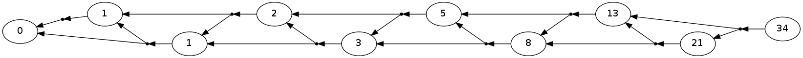

Tutorial 1: Fibonacci
=====================

We begin by looking at one of the simplest dynamic programming
algorithms, generating a fibonacci sequence. While there are simpler and
more efficient ways to generate this will give us a simple problem to
introduce the main data structures of pydecode.

First we import libraries.

.. code:: python

    # The main pydecode library.
    import pydecode
    # Libary for visualization.
    import pydecode.display
    import numpy as np
The standard Fibonacci DP takes the following form.

.. code:: python

    n = 10
    chart = {}
    chart[0] = 0
    chart[1] = 0 + 1 
    for i in range(2, n):
        chart[i] = chart[i-1] + chart[i-2]
    print chart.values()[1:]

.. parsed-literal::

    [1, 1, 2, 3, 5, 8, 13, 21, 34]

Using common terminology, let's call ``chart`` the chart and its indices
the items, and the constant 1 and output value.

The PyDecode representation requires that we pre-declare the items and
outputs of the dynamic program and use numpy for accessing them. This
leads to a bit of overhead, but will be very useful for more detailed
dynamic programs.

.. code:: python

    items = np.arange(10)
    outputs = np.arange(1)
    c = pydecode.ChartBuilder(items, outputs)
The dynamic program takes a very similar form as the python version.

.. code:: python

    c.init(items[[0]])
    c.set(items[1], items[[0]], out=outputs[[0]])
    for i in range(2, items.size):
        c.set(items[i], items[[i-1]], items[[i-2]])
    dp = c.finish()
Note one tricky element. Both ``set`` and ``init`` takes numpy arrays as
arguments. For most problems this will simplify the notation, but when
we only want a single value (as with ``init``) this requires using
double indexing.

.. code:: python

    print items[[0]]
    print items[0]

.. parsed-literal::

    [0]
    0

Once we have constructed a dynamic program, we can run very efficiently
run computations over its structure. For instance we can compute the
value at each item.

.. code:: python

    fill = pydecode.fill(dp, np.array([1.0]))
    fill[1:]

.. parsed-literal::

    array([  1.,   1.,   2.,   3.,   5.,   8.,  13.,  21.,  34.])

Furthermore, we can visualize this construction by mapping these value
over the graph of computations.

.. code:: python

    pydecode.display.HypergraphFormatter(dp.hypergraph, vertex_labels=np.array(fill, dtype=np.uint8), show_hyperedges=False).to_ipython()

This data structure is known as a hypergraph, and it underlies each of
the algorithms used in PyDecode. We will see more of these structures in
the coming tutorials.
