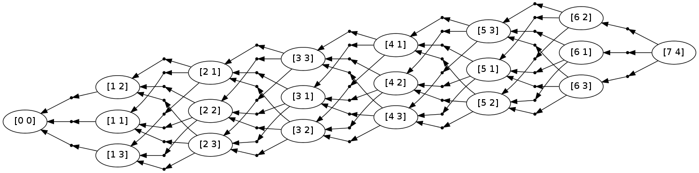
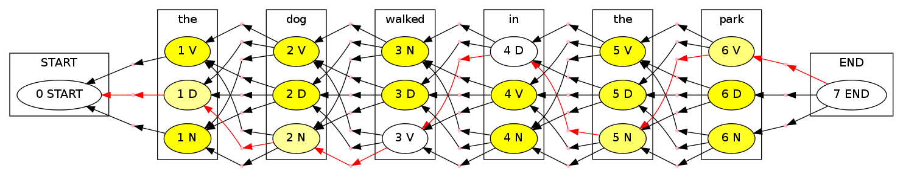

Tutorial 3: HMM Tagger
======================

This tutorial extends edit distance to a richer decoding problem,
part-of-speech tagging.

.. code:: python

    import pydecode
    import pydecode.display as display
    import pandas as pd
    import matplotlib.pyplot as plt
    import numpy as np
For this example, we assume a toy part-of-speech tagging model. Our
model will be a simple bigram hidden Markov model, with boundary states
START and END.

.. code:: python

    tags = ["START", "D", "N", "V", "END"]
    
    # The emission probabilities.
    emission = {'START' : {'START' : 1.0},
                'the' :  {'D': 0.8, 'N': 0.1, 'V': 0.1},
                'dog' :  {'D': 0.1, 'N': 0.8, 'V': 0.1},
                'walked':{'V': 1},
                'in' :   {'D': 1},
                'park' : {'N': 0.1, 'V': 0.9},
                'END' :  {'END' : 1.0}}
    
    # The transition probabilities.
    transition = {'D' :    {'D' : 0.1, 'N' : 0.8, 'V' : 0.1, 'END' : 0},
                  'N' :    {'D' : 0.1, 'N' : 0.1, 'V' : 0.6, 'END' : 0.2},
                  'V' :    {'D' : 0.4, 'N' : 0.3, 'V' : 0.2, 'END' : 0.1},
                  'START' : {'D' : 0.4, 'N' : 0.3, 'V' : 0.3},
                  'END': {'END' : 1.0}}
    T = pd.DataFrame(transition).fillna(0) 
    E = pd.DataFrame(emission).fillna(0)
    print T
    print E

.. parsed-literal::

           D  END    N  START    V
    D    0.1    0  0.1    0.4  0.4
    END  0.0    1  0.2    0.0  0.1
    N    0.8    0  0.1    0.3  0.3
    V    0.1    0  0.6    0.3  0.2
           END  START  dog  in  park  the  walked
    D        0      0  0.1   1   0.0  0.8       0
    END      1      0  0.0   0   0.0  0.0       0
    N        0      0  0.8   0   0.1  0.1       0
    START    0      1  0.0   0   0.0  0.0       0
    V        0      0  0.1   0   0.9  0.1       1

Here is the PyDecode implementation of the Viterbi algorithm for
tagging.

.. code:: python

    def viterbi(n):
        t = len(tags)
        # Initialization.
        items = np.arange(n * t).reshape([n, t])
        outputs = np.arange(n * t * t).reshape([n, t, t])
        c = pydecode.ChartBuilder(items, outputs)
        
        # The tags allowed at each position.
        K = [[0]] + [range(1, t-1)] * (n-2) + [[t-1]]
    
        # Viterbi.
        c.init(items[0, K[0]])
        for i in range(1, n):
            for t in K[i]:
                c.set(items[i, t],
                      items[i-1, K[i-1]],
                      out=outputs[i, t, K[i-1]])
        return c.finish()
.. code:: python

    # A sentence to be tagged.
    sentence = 'START the dog walked in the park END'.split()
    dp = viterbi(len(sentence))
.. code:: python

    vertex_labels = pydecode.vertex_items(dp)
    display.HypergraphFormatter(dp.hypergraph, vertex_labels=vertex_labels, show_hyperedges=False).to_ipython()

To make the scores we again compute a value for each of the possible
outputs.

.. code:: python

    def make_scores(words, outputs):
        n = len(words)
        scores = np.zeros(outputs.shape)
        for i, tag, prev_tag in np.ndindex(outputs.shape):
            scores[i, tag, prev_tag] = \
                transition[tags[prev_tag]].get(tags[tag], 0.0) * \
                emission[words[i]].get(tags[tag], 0.0)
        return scores
    output_scores = make_scores(sentence, dp.outputs)
.. code:: python

    best = pydecode.argmax(dp, output_scores, kind=pydecode.Inside)
    best

.. parsed-literal::

    array([[1, 1, 0],
           [2, 2, 1],
           [3, 3, 2],
           [4, 1, 3],
           [5, 2, 1],
           [6, 3, 2],
           [7, 4, 3]])

.. code:: python

    scores = dp.output_matrix.T * output_scores.ravel()
    path = pydecode.best_path(dp.hypergraph, scores, kind=pydecode.Inside)
    node_marg, _ = pydecode.marginals(dp.hypergraph, scores, kind=pydecode.Inside)
    normalized_marg = node_marg / node_marg[dp.hypergraph.root.id]
    normalized_marg

.. parsed-literal::

    array([ 1.        ,  0.9358864 ,  0.01666875,  0.04744485,  0.00357674,
            0.98624913,  0.01017413,  0.        ,  0.        ,  1.        ,
            1.        ,  0.        ,  0.        ,  0.28387177,  0.67849973,
            0.03762849,  0.        ,  0.21191252,  0.78808748,  1.        ])

.. code:: python

    m = min(normalized_marg)
    M = max(normalized_marg)
    
    
    class HMMFormat(display.HypergraphPathFormatter):
        def label(self, node):
            label = self._vertex_labels[node.id]
            return "%d %s"%(label[0], tags[label[1]])
        def hyperedge_node_attrs(self, edge):
            return {"color": "pink", "shape": "point"}
        def hypernode_subgraph(self, node):
            return [("cluster_" + str(self._vertex_labels[node.id][0]), None)]
        def subgraph_format(self, subgraph):
            return {"label": (sentence)[int(subgraph.split("_")[1])],
                    "rank" : "same"}
        def graph_attrs(self): return {"rankdir":"RL"}
    
        def hypernode_attrs(self, node):
            return {"shape": "",
                    "label": self.label(node),
                    "style": "filled",
                    "fillcolor": "#FFFF%d"%(int(((normalized_marg[node.id] - m) / (M-m)) * 100))}
    
    HMMFormat(dp.hypergraph, vertex_labels=vertex_labels).set_paths([path]).to_ipython()

.. code:: python

    item = pydecode.item_marginals(dp, output_scores)
    plt.pcolor(item.T)
    plt.yticks(np.arange(0.5, len(tags), 1), tags)
    plt.xticks(np.arange(0.5, len(sentence), 1), sentence)
    None

::

    ---------------------------------------------------------------------------
    TypeError                                 Traceback (most recent call last)

    <ipython-input-10-f33f4810bb0b> in <module>()
    ----> 1 item = pydecode.item_marginals(dp, output_scores)
          2 plt.pcolor(item.T)
          3 plt.yticks(np.arange(0.5, len(tags), 1), tags)
          4 plt.xticks(np.arange(0.5, len(sentence), 1), sentence)
          5 None

    /home/srush/Projects/decoding/python/pydecode/__init__.pyc in item_marginals(dp, out_potentials, kind)
        298     node_marginals, _ = marginals(dp.hypergraph,
        299                                   potentials, None, None, kind)
    --> 300     return (dp.item_matrix * node_marginals).reshape(
        301         dp.items.shape)
        302 

    /home/srush/Projects/decoding/python/pydecode/potentials.so in pydecode.potentials.DynamicProgram.item_matrix (python/pydecode/potentials.cpp:14124)()

    /home/srush/Projects/decoding/python/pydecode/potentials.so in pydecode.potentials.DynamicProgram._make_item_matrix (python/pydecode/potentials.cpp:13810)()

    TypeError: can only concatenate list (not "int") to list

