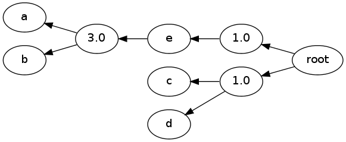

Simple Hypergraph Example
=========================

.. code:: python

    import pydecode.hyper as hyper
    import pydecode.display as display
    import networkx as nx 
    import matplotlib.pyplot as plt 
.. code:: python

    hyp = hyper.Hypergraph()
    with hyp.builder() as b:
         n1 = b.add_node("first", terminal=True)
         n2 = b.add_node("second")
         b.add_edge(n2, [n1], label = "Edge")
Draw the graph

.. code:: python

    G = display.to_networkx(hyp)
    nx.draw(G)
    plt.show()

