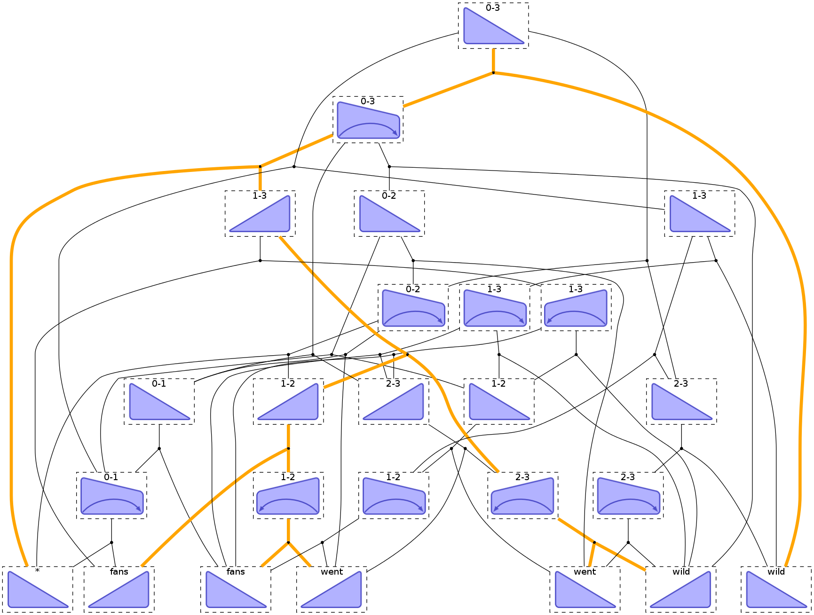

Tutorial 4: Dependency Parsing
==============================

.. code:: python

    import pydecode
    import pydecode.display as display
    import numpy as np
    import numpy.random
    import matplotlib.pyplot as plt
    import pandas as pd
.. code:: python

    kShapes = 2
    Tri = 0; Trap = 1
    kDir = 2
    Right = 0; Left = 1
.. code:: python

    def eisner_first_order(n):
        coder = np.arange((kShapes * kDir * n * n), dtype=np.int64) \
            .reshape([kShapes, kDir, n, n])
        out = np.arange(n*n, dtype=np.int64).reshape([n, n])
        c = pydecode.ChartBuilder(coder, out)
    
        # Add terminal nodes.
        c.init(np.diag(coder[Tri, Right]))
        c.init(np.diag(coder[Tri, Left, 1:, 1:]))
    
        for k in range(1, n):
            for s in range(n):
                t = k + s
                if t >= n:
                    break
    
                # First create incomplete items.
                out_ind = np.zeros([t-s], dtype=np.int64)
                if s != 0:
                    out_ind.fill(out[t, s])
                    c.set(coder[Trap, Left,  s,       t],
                          coder[Tri,  Right, s,       s:t],
                          coder[Tri,  Left,  s+1:t+1, t],
                          out=out_ind)
    
                out_ind.fill(out[s, t])
                c.set(coder[Trap, Right, s,       t],
                       coder[Tri,  Right, s,       s:t],
                       coder[Tri,  Left,  s+1:t+1, t],
                       out=out_ind)
    
    
                if s != 0:
                    c.set(coder[Tri,  Left,  s,   t],
                          coder[Tri,  Left,  s,   s:t],
                          coder[Trap, Left,  s:t, t])
    
                c.set(coder[Tri,  Right, s,       t],
                      coder[Trap, Right, s,       s+1:t+1],
                      coder[Tri,  Right, s+1:t+1, t])
    
        return c.finish()
.. code:: python

    dp = eisner_first_order(4)

.. parsed-literal::

    -c:7: FutureWarning: Numpy has detected that you (may be) writing to an array returned
    by numpy.diagonal or by selecting multiple fields in a record
    array. This code will likely break in the next numpy release --
    see numpy.diagonal or arrays.indexing reference docs for details.
    The quick fix is to make an explicit copy (e.g., do
    arr.diagonal().copy() or arr[['f0','f1']].copy()).
    -c:8: FutureWarning: Numpy has detected that you (may be) writing to an array returned
    by numpy.diagonal or by selecting multiple fields in a record
    array. This code will likely break in the next numpy release --
    see numpy.diagonal or arrays.indexing reference docs for details.
    The quick fix is to make an explicit copy (e.g., do
    arr.diagonal().copy() or arr[['f0','f1']].copy()).

.. code:: python

    sentence = "fans went wild"
    output_scores = np.random.random(dp.outputs.size).ravel()
    scores = dp.output_matrix.T * output_scores
    path = pydecode.best_path(dp.hypergraph, scores)
    best = scores.T * path.v
    print pydecode.path_output(dp, path)

.. parsed-literal::

    [[2 1]
     [3 2]
     [0 3]]

.. code:: python

    node_marginals, edge_marginals = pydecode.marginals(dp.hypergraph, scores)
    
    avg = np.sum(edge_marginals) / len(dp.hypergraph.edges)
    thres = 0.4 * best + 0.6 * avg
    edge_filter = np.array(edge_marginals >=thres, dtype=np.int8)
    _, projection, pruned_hyper = pydecode.project(dp.hypergraph, edge_filter)
    pruned_scores = projection * scores
.. code:: python

    mat = np.reshape(dp.output_matrix *  edge_marginals, dp.outputs.shape).T
    plt.pcolor(mat.T)
    plt.yticks(np.arange(0.5, len(sentence.split()), 1), ["*"] + sentence.split())
    plt.xticks(np.arange(0.5, len(sentence.split()), 1), ["*"] + sentence.split())
    None

.. image:: parsing_files/parsing_7_0.png

.. code:: python

    vertex_labels = pydecode.vertex_items(dp)
    class ParseFormat(display.HypergraphPathFormatter):
        def graph_attrs(self):
            return {"rankdir": "TB", "clusterrank": "local"}
        def hypernode_attrs(self, vertex):
            label = self._vertex_labels[vertex.id]
            return {"image": "images/" +
                    ("triangle" if label[0] == Tri else "trap") + "-" + 
                    ("right" if label[1] == Right else "left") + ".png",
                    "labelloc": "t",
                    "shape": "rect",
                    "style" : "dashed",
                    "label": "%d-%d"%(label[2], label[3]) 
                    if label[2] != label[3] else 
                    (["*"] + sentence.split())[label[2]],
    
                    }
        def hypernode_subgraph(self, vertex):
            label = self._vertex_labels[vertex.id]
            if label[2] == label[3]:
                return [("clust_terminals", label[2] + (0.5 if label[1] == Right else 0))]
            return []
        def subgraph_format(self, subgraph):
            return {"rank": "same"}
        def hyperedge_node_attrs(self, edge):
            return {"shape": "point"}
        def hyperedge_attrs(self, edge):
            return {"arrowhead": "none", 
                    "color": "orange" if edge in self.paths[0] else "black",
                    "penwidth": 5 if edge in self.paths[0] else 1}
    
    ParseFormat(dp.hypergraph, 
                vertex_labels=vertex_labels).set_paths([path]).to_ipython()

