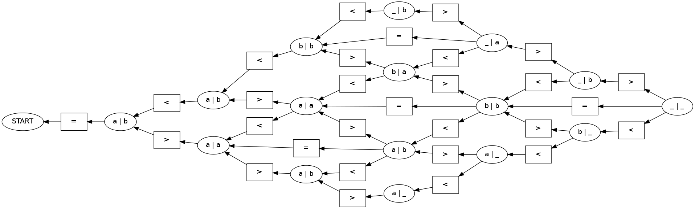
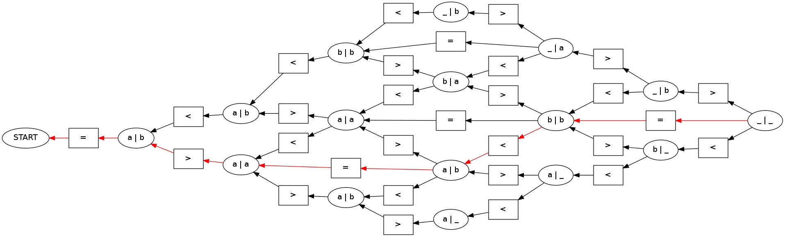

Tutorial 2: Edit Distance
=========================

.. code:: python

    import pydecode.hyper as ph
    import pydecode.chart as chart
    import pydecode.semiring as semi
In this tutorial, we will consider solving an edit distance problem
using PyDecode. This will provide an overview of

-  Constructing a dynamic program.
-  Assigning scores to operations.
-  Using more advanced queries.

For an overview of the edit distance problem, see the wikipedia article
on Levenshtein distance,
http://en.wikipedia.org/wiki/Levenshtein\_distance.

.. code:: python

    
    class Op:
        def __init__(self, v): self.v = v 
    
        def __eq__(self, other): return self.v == other.v
    
        def __str__(self):
            return {(1,0): "<", (0,1): ">", (1,1): "="}[self.v]
    
    
    Op.Ins = Op((1, 0)) 
    Op.Del = Op((0, 1)) 
    Op.Mat = Op((1, 1))
    
    class Problem:
        def __init__(self, str1, str2):
            self.str1 = str1 + "_"
            self.str2 = str2 + "_"
        
        def match(self, i, j):
            if i >= 0 and j >= 0: return self.str1[i] == self.str2[j]
            return True
    
        def show(self, ops):
            pos = [0, 0]
            for op in ops:
                if op == op.Mat:
                    print "%1s %1s %1s"%(self.str1[pos[0]], op, self.str2[pos[1]])
                elif op == op.Del:
                    print "%1s %1s %1s"%("", op, self.str2[pos[1]])
                elif op == op.Ins:
                    print "%1s %1s %1s"%(self.str1[pos[0]], op, "")
                pos[0] += op.v[0]
                pos[1] += op.v[1]
    
    problem = Problem("aab", "bab")
    problem.show([Op.Del, Op.Ins, Op.Mat, Op.Del, Op.Ins])

.. parsed-literal::

      > b
    a <  
    a = a
      > b
    b <  

.. code:: python

    class State:
        def __init__(self, i, j, prob):
            self.i = i
            self.j = j
            self.prob = prob
    
        def __hash__(self): return hash((self.i, self.j))
        def __eq__(self, other): return (self.i, self.j) == (other.i, other.j)
    
        def __str__(self):
            if self.i >= 0 and self.j >= 0:
                return "%s | %s" % (self.prob.str1[self.i], self.prob.str2[self.j])
            return "START"
    
        def op(self, op):
            return State(self.i-op.v[0], self.j-op.v[1], self.prob)

.. code:: python

    def edit_distance(c, prob):
        c.init(State(-1, -1, prob))
        for i, s_char in enumerate(prob.str1):
            for j, t_char in enumerate(prob.str2):
                state = State(i, j, prob)
                c[state] = \
                    c.sum(( c[state.op(m)] * c.sr(m) 
                            for m in [Op.Ins, Op.Del, Op.Mat] 
                            if m != Op.Mat or prob.match(i-1, j-1)))
        return c
.. code:: python

    c = chart.ChartBuilder(semiring=chart.HypergraphSemiRing, 
                           build_hypergraph=True)
    hypergraph = edit_distance(c, problem).finish()
.. code:: python

    import pydecode.display as display
    display.HypergraphFormatter(hypergraph).to_ipython()

.. code:: python

    def weight_function(op):
        if op == Op.Mat: return 1
        else: return 0
    weights = ph.Weights(hypergraph).build(weight_function)
    path = ph.best_path(hypergraph, weights)
.. code:: python

    display.HypergraphPathFormatter(hypergraph, [path]).to_ipython()

.. code:: python

    ops = [hypergraph.label(edge) for edge in path][1:]
    problem.show(ops)

.. parsed-literal::

      > b
    a = a
    a <  
    b = b

.. code:: python

    p2 = Problem("hello this is a longer sequence", "hello ths is a longr seqence")
    c2 = chart.ChartBuilder(semiring=chart.HypergraphSemiRing, 
                           build_hypergraph=True)
    hypergraph2 = edit_distance(c2, p2).finish()
    weights2 = ph.Weights(hypergraph2).build(weight_function)
    path2 = ph.best_path(hypergraph2, weights2)
    p2.show([hypergraph2.label(edge) for edge in path2][1:])

.. parsed-literal::

    h = h
    e = e
    l = l
    l = l
    o = o
      =  
    t = t
    h = h
    i <  
    s = s
      =  
    i = i
    s = s
      =  
    a = a
      =  
    l = l
    o = o
    n = n
    g = g
    e <  
    r = r
      =  
    s = s
    e = e
    q = q
    u <  
    e = e
    n = n
    c = c
    e = e

.. code:: python

    len(hypergraph2.nodes), len(hypergraph2.edges)

.. parsed-literal::

    (929, 1879)

.. code:: python

    pruned_hypergraph, pruned_weights = ph.prune_hypergraph(hypergraph2, weights2, 0.6)
    len(pruned_hypergraph.nodes), len(pruned_hypergraph.edges)

.. parsed-literal::

    (217, 413)

.. code:: python

    display.HypergraphFormatter(pruned_hypergraph).to_ipython()