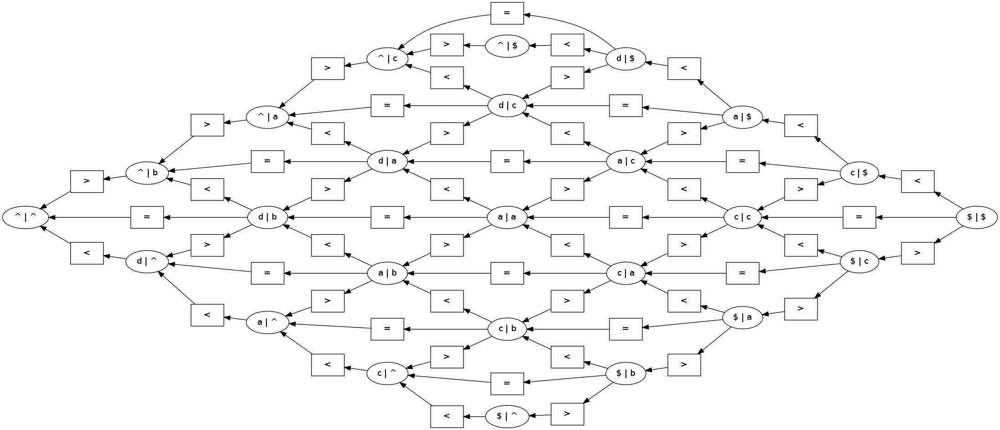
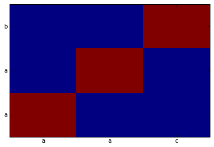
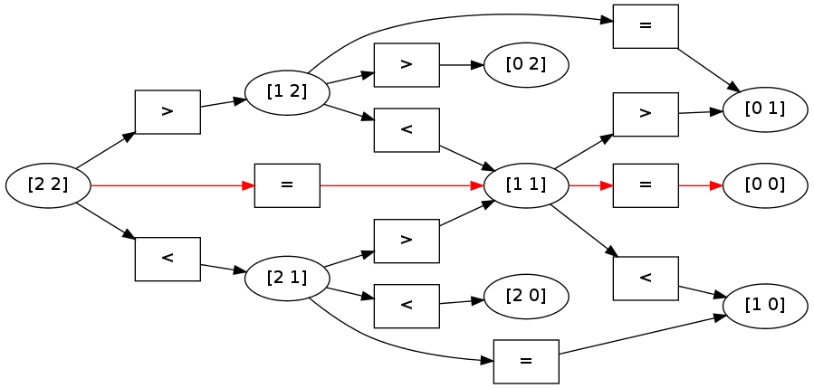
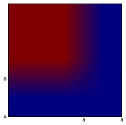

Tutorial 2: Edit Distance
=========================

In this tutorial, we look at a more substantial dynamic programming
problem: computing the edit distance between two strings. In this
notebook, we show how to

-  Construct a dynamic program.
-  Assign scores to labels.
-  Compute max-marginal values.

We beging by importing the standard libraries.

.. code:: python

    import pydecode
    import numpy as np
    import matplotlib.pyplot as plt
Edit distance is computes the score of the best alignment two strings. An alignment consists of a 
sequence of single operations 

* Insert : Generate a character only in the first string.
* Delete : Generate a character only in the second string.
* Match : Generate the same character in both string.

For a detailed overview of the edit distance problem, see the wikipedia article on `Levenshtein distance <http://en.wikipedia.org/wiki/Levenshtein_distance>`_.,

.. _`Levenshtein distance`  http://en.wikipedia.org/wiki/Levenshtein_distance.

We begin by defining the basic operations available for edit distance,
and giving the dynamic program for edit distance.

.. code:: python

    kInsert, kDelete, kMatch = 0, 1, 2
    operations = np.array([kInsert, kDelete, kMatch])
    offsets = np.array([[1,0], [0,1], [1,1]]) 
    op_names = np.array(["<",  ">",  "="])
.. code:: python

    def grid(m, n, o=None):
        if o is None:
            return np.arange(m * n).reshape((m, n))
        else:
            return np.arange(m * n * o).reshape((m, n, o))
    grid(5,5)

.. parsed-literal::

    array([[ 0,  1,  2,  3,  4],
           [ 5,  6,  7,  8,  9],
           [10, 11, 12, 13, 14],
           [15, 16, 17, 18, 19],
           [20, 21, 22, 23, 24]])

In this tutorial we will take advantage of a numpy trick to covert indices back into 
their grid coordinates. 

.. code:: python

    def ungrid(items, shape):
        return np.array(np.unravel_index(items, shape)).T
    ungrid([1, 2, 3, 4], (5, 5))

.. parsed-literal::

    array([[0, 1],
           [0, 2],
           [0, 3],
           [0, 4]])

Edit distance is defined by the following base case and recursions 

.. math::

    C_{0, 0} &=& 0\ \ \  \forall \  j \in \{ 0 \ldots m \} \\
    C_{0, j} &=& 0\ \ \ \forall \  j \in \{ 1 \ldots m \} \\
    C_{i, 0} &=& 0\ \ \  \forall\  i \in \{ 1 \ldots n \} \\
    \\
    C_{i, j} &=& \max \begin{array}{ll}C_{i-1, j} +  W_{i-1, j, DELETE} \\ C_{i, j-1}  + W_{i, j-1, INSERT} \\ C_{i-1, j-1} + W_{i-1, j-1, MATCH}  \end{array} \ \ \forall i \in \{ 1 \ldots m \} ,j \in \{ 1 \ldots n \}    \\

.. code:: python

    def edit_distance(m, n):
    
        # Create a grid for the items and labels.
        item_grid = grid(m, n)
        op_grid = grid(m, n, len(operations))
        c = pydecode.ChartBuilder(item_grid)
    
        # Construct the base cases. 
        c.init(item_grid[0, 0])
        c.init(item_grid[0, 1:])
        c.init(item_grid[1:, 0])
        
        # Construct the recursion.
        for i in range(1, m):
            for j in range(1, n):
                c.set(item_grid[i, j], 
                      [[item_grid[i-1, j]],
                       [item_grid[i, j-1]],
                       [item_grid[i-1, j-1]]],
                      [op_grid[i-1, j, kDelete],
                       op_grid[i, j-1, kInsert],
                       op_grid[i-1, j-1, kMatch]])
        return c.finish()
.. code:: python

    graph = edit_distance(3, 3)
To get a better sense of this dynamic program, we can visualize its
structure.

.. code:: python

    # Construct readable labels for each of the vertices and edges in the graph.
    label_names = ungrid(graph.node_labeling, (3,3))
    label_ops = op_names[ungrid(graph.labeling, (3,3,3))[:, 2]]
    pydecode.draw(graph, label_ops, label_names)
    # hyperedge_labels = op_names[pydecode.hyperedge_outputs(dp)[2]]
    # display.HypergraphFormatter(dp.hypergraph, vertex_labels=vertex_labels, hyperedge_labels=hyperedge_labels).to_ipython()

This structure can then be used for queries about the underlying strings. 
First, we might ask what the best alignment is between the two strings. To do this,
we need to assign as score to each output in the dynamic program. Each of these outputs 
corresponds to choosing an operation at each of the position pair.

Let\'s give all operations a score of zero, except for Match which 
can only be applied when we have a direct match. 

.. math::

    W_{i, j, o} &=& 0 \ \ \forall i, j, o \in \{DELETE, INSERT \}
    W_{i, j, MATCH} &=& 1 \ \ \forall i, j, s_i == s_j
    W_{i, j, MATCH} &=& -\infty \ \ \forall i, j, s_i != s_j
    

.. code:: python

    def make_scores(string1, string2):
        m, n = len(string1), len(string2)
        scores = np.zeros((m, n, 3))
        for i, s in enumerate(string1):
            for j, t in enumerate(string2):
                scores[i, j, kMatch] = 1.0 if s == t \
                                           else -1e8
        return scores
    string1, string2 = "aab", "aac"
    scores = make_scores(string1, string2)
    weights = pydecode.transform(graph, scores)
Finding the best alignment is simply a matter of calling the argmax
function. This retuns the best outputs under our scoring function. We
can then transform these into an easier to view format.

.. code:: python

    path = pydecode.best_path(graph, weights)
    ungrid([edge.label for edge in path.edges], (3,3, 3))
    ungrid([node.label for node in path.nodes], (3,3))

.. parsed-literal::

    array([[0, 0],
           [1, 1],
           [2, 2]])

.. code:: python

    chart = np.zeros((3,3))
    best = ungrid([node.label for node in path.nodes], (3,3))
    chart[best.T[:2][0], best.T[:2][1]] = 1
    plt.pcolor(chart)
    plt.yticks(np.arange(0.5, len(string1), 1), string1)
    plt.xticks(np.arange(0.5, len(string2), 1), string2)
    None

Furthermore, we can map these scores directly onto the hypergraph, to
see which path was chosen as the highest scoring.

.. code:: python

    pydecode.draw(graph, label_ops, label_names, paths=[path])

Another common query is for the max-marginals of a given dynamic
program. The max-marginals given the highest scoring alignment that uses
a particular item or output in the dynamic program. These can be very
useful for pruning, training models, and decoding with partial data.

.. code:: python

    np.max(graph.labeling) +1

.. parsed-literal::

    22

.. code:: python

    graph.labeling

.. parsed-literal::

    array([ 4,  9,  2,  7, 12,  5, 13, 18, 11, 16, 21, 14], dtype=int32)

.. code:: python

    
    edge_max_marginals = pydecode.marginals(graph, weights)
    
    label_max_marginals = pydecode.inverse_transform(graph, edge_max_marginals, 
                                                     size=3*3*3)
    
    label_max_marginals = label_max_marginals.reshape(3,3,3)
.. code:: python

    

.. parsed-literal::

    [[  2.00000000e+00   1.00000000e+00  -1.00000000e+09]
     [  1.00000000e+00   2.00000000e+00  -1.00000000e+09]
     [ -1.00000000e+09  -1.00000000e+09  -1.00000000e+09]]

.. code:: python

    plt.imshow(label_max_marginals[:,:, kMatch])
    plt.yticks(np.arange(1.5, len(string1)), string1)
    plt.xticks(np.arange(1.5, len(string2)), string2)
    None

Finally we look at a longer alignment example.

.. code:: python

    # strings = np.array(["hllo this is a longer sequence", 
    #                     "hello ths is a longr seqence"])
    # dp = edit_distance(strings)
    # output_scores = make_scores(strings, dp.outputs)
    # best = pydecode.argmax(dp, output_scores)
.. code:: python

    # chart = np.zeros(dp.items.shape)
    # chart[best.T[:2][0], best.T[:2][1]] = 1
.. code:: python

    # plt.imshow(chart)
    # plt.yticks(np.arange(1.5, len(strings[0])+1, 1), strings[0])
    # plt.xticks(np.arange(1.5, len(strings[1])+1, 1), strings[1])
    # None