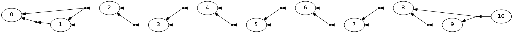

Tutorial: Fibonacci
===================

.. code:: python

    import pydecode.hyper as ph
    import pydecode.chart as chart
.. code:: python

    def fibo_dp(c, n):
        c.init(0)
        c[1] = c[0] * c.sr(1)
        for i in range(2, n + 1):
            c[i] = c[i - 1] * c[i - 2]
        return c
.. code:: python

    c = chart.ChartBuilder(semiring=chart.ViterbiSemiRing)
    fibo_dp(c, 10).finish()

.. parsed-literal::

    55.0

.. code:: python

    c = chart.ChartBuilder(semiring=chart.HypergraphSemiRing, 
                           build_hypergraph=True)
    hypergraph = fibo_dp(c, 10).finish()
.. code:: python

    import pydecode.display as display
    display.HypergraphFormatter(hypergraph, show_hyperedges=False).to_ipython()

