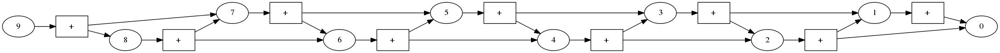
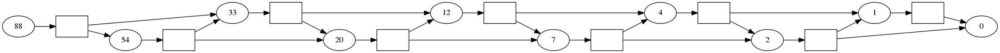

Tutorial 1: Fibonacci
=====================

.. code:: python

    import pydecode
    import numpy as np
We begin by looking at one of the simplest dynamic programming
algorithm, generating a fibonacci sequence. While there are many ways to
generate this sequence, the undelying dynamic programming algorithm acts
as a nice base for introducing the central data structures in PyDecode.

The Fibonacci sequence is defined by the base case and recursions 

.. math::

    C_0 &=& 0 \\
    C_1 &=& 1   \\
    C_i &=& C_i + C_{i-1}

The bottom-up algorithm for generating this sequence takes a simple form. We begin 
by initializing a ``chart`` with the base cases, and then loop over each ``item`` 
to specify the recurrence.

.. code:: python

    n = 10
    chart = np.zeros(10)
    chart[0] = 0
    chart[1] = chart[0] + 1
    for item in range(2, n):
        chart[item] = chart[item-1] + chart[item-2]
    chart

.. parsed-literal::

    array([  0.,   1.,   1.,   2.,   3.,   5.,   8.,  13.,  21.,  34.])

In PyDecode, a dynamic program is specified using a very similar 
bottom-up style. 

* To begin we we specify the set of items.
* For the base cases we use ``init``.
* For recursion we use ``set`` or ``set_t``.
* For constants (like + 1) we use ``labels``.

.. code:: python

    chart = pydecode.ChartBuilder(np.arange(10))
    chart.init(0)
    chart.set(1, [[0]], labels=[0])
    
    for item in range(2, n):
        chart.set(item, [[item-1, item-2]])
    graph = chart.finish()
Note that the second argument of ``set`` is a list of list. For
Fibonacci we only pass a single list, but in the next section we will
use the full functionality.

Once we have constructed a PyDecode ``graph`` we can run various 
computations over the dynamic programming structure. For instance
we can compute the table of values as above.   

.. code:: python

    weights = pydecode.transform(graph, np.array([1.0]))
    inside = pydecode.inside(graph, weights)
    inside

.. parsed-literal::

    array([  0.,   1.,   2.,   4.,   7.,  12.,  20.,  33.,  54.,  88.])

But since we have this structure in memory, we can also visualize the 
computations that are occuring at each stage.  

.. code:: python

    pydecode.draw(graph, np.array(["+"]*10), graph.node_labeling)

Here each oval vertex shows an item in the dynamic program, and each
box vertex indicates which children are part of the recurrence. This
data structure is known as a ``hypergraph`` and it is the central data
structure used for the algorithms implemented in PyDecode. See
:doc:`Hypergraph<doc/Hypergraph>` for a full description of the data structure. 

We can further add information to this graph. For instance we can easily overlay the 
chart of computed on stop of the computations. This provide a useful method for debugging 
the algorithm.

.. code:: python

    pydecode.draw(graph, vertex_labels=np.array(inside, dtype=np.int32))

But visualizing computations is only one use of the library. In the
next tutorial we'll look at using PyDecode to efficiently compute other 
important values from a dynamic program.
