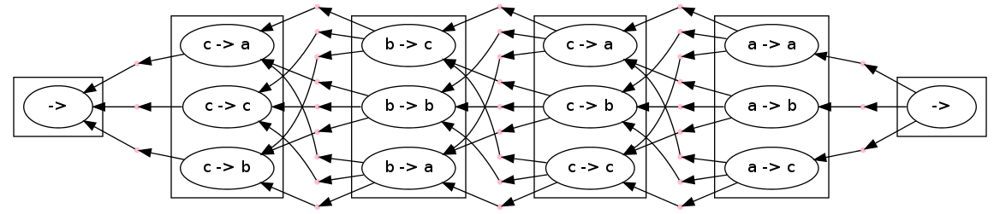
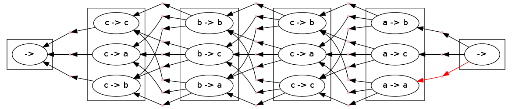
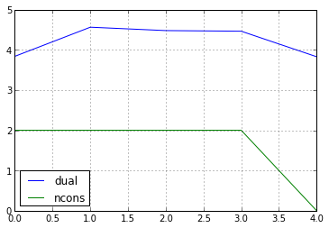
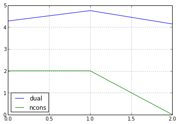

Decipherment Note
=================

This is a note on running decipherment.

.. code:: python

    from nltk.util import ngrams
    from nltk.model.ngram import NgramModel
    from nltk.probability import LidstoneProbDist
    import random, math

    class Problem:
        def __init__(self, corpus):
            self.t = corpus
            t = list(self.t)
            est = lambda fdist, bins: LidstoneProbDist(fdist, 0.0001)
            self.lm = NgramModel(2, t, estimator = est)

            self.letters = set(t) #[chr(ord('a') + i) for i in range(26)]
            self.letters.remove(" ")
            shuffled = list(self.letters)
            random.shuffle(shuffled)
            self.substitution_table = dict(zip(self.letters, shuffled))
            self.substitution_table[" "] = " "

        def make_cipher(self, plaintext):
            self.ciphertext = "".join([self.substitution_table[l] for l in plaintext])
            self.plaintext = plaintext
    simple_problem = Problem("ababacabac ")
    simple_problem.make_cipher("abac")

.. parsed-literal::

.. code:: python

    import pydecode.hyper as hyper
    import pydecode.display as display
    from collections import namedtuple
.. code:: python

    class Conversion(namedtuple("Conversion", ["i", "cipherletter", "prevletter", "letter"])):
        __slots__ = ()
        def __str__(self):
            return "%s %s %s"%(self.cipherletter, self.prevletter, self.letter)
    class Node(namedtuple("Node", ["i", "cipherletter", "letter"])):
        __slots__ = ()
        def __str__(self):
            return "%s %s %s"%(self.i, self.cipherletter, self.letter)
.. code:: python

    def build_cipher_graph(problem):
        ciphertext = problem.ciphertext
        letters = problem.letters
        hypergraph = hyper.Hypergraph()
        with hypergraph.builder() as b:
            prev_nodes = [(" ", b.add_node([], label=Node(-1, "", "")))]
            for i, c in enumerate(ciphertext):
                nodes = []
                possibilities = letters
                if c == " ": possibilities = [" "]
                for letter in possibilities:
                    edges = [([prev_node], Conversion(i, c, old_letter, letter))
                             for (old_letter, prev_node) in prev_nodes]

                    node = b.add_node(edges, label = Node(i, c, letter))
                    nodes.append((letter, node))
                prev_nodes = nodes
            letter = " "
            final_edges = [([prev_node], Conversion(i, c, old_letter, letter))
                           for (old_letter, prev_node) in prev_nodes]
            b.add_node(final_edges, label=Node(len(ciphertext), "", ""))
        return hypergraph
.. code:: python

    hyper1 = build_cipher_graph(simple_problem)
.. code:: python

    class CipherFormat(display.HypergraphPathFormatter):
        def hypernode_attrs(self, node):
            label = self.hypergraph.node_label(node)
            return {"label": "%s -> %s"%(label.cipherletter, label.letter)}
        def hyperedge_node_attrs(self, edge):
            return {"color": "pink", "shape": "point"}
        def hypernode_subgraph(self, node):
            label = self.hypergraph.node_label(node)
            return [("cluster_" + str(label.i), label.i)]
        # def subgraph_format(self, subgraph):
        #     return {"label": (sentence.split() + ["END"])[int(subgraph.split("_")[1])]}

    display.to_ipython(hyper1, CipherFormat(hyper1, []))

.. code:: python

Constraint is that the sum of edges with the conversion is equal to the
0.

l^2 constraints

.. code:: python

    def build_constraints(hypergraph, problem):
        ciphertext = problem.ciphertext
        letters = problem.letters
        constraints = hyper.Constraints(hypergraph)
        def transform(from_l, to_l): return "letter_%s_from_letter_%s"%(to_l, from_l)
        first_position = {}
        count = {}
        for i, l in enumerate(ciphertext):
            if l not in first_position:
                first_position[l] = i
            count.setdefault(l, 0)
            count[l] += 1
        def build(conv):
            l = conv.cipherletter
            if l == " ": return []
            if conv.letter == " ": return []
            if first_position[l] == conv.i:
                return [(transform(conv.cipherletter, conv.letter), count[l] - 1)]
            else:
                return [(transform(conv.cipherletter, conv.letter), -1)]
        constraints.build([(transform(l, l2), 0)
                           for l  in letters
                           for l2 in letters],
                          build)
        return constraints
    constraints = build_constraints(hyper1, simple_problem)

.. code:: python

    def build_weights(edge):
        return random.random()
    weights = hyper.Weights(hyper1).build(build_weights)
.. code:: python

    for edge in hyper1.edges:
        print weights[edge]

.. parsed-literal::

    0.439529396568
    0.118871071994
    0.789021590346
    0.773859760987
    0.331166719804
    0.210266437624
    0.644248381653
    0.947822640217
    0.623687349699
    0.0619245821011
    0.428125980304
    0.947963838136
    0.413298343627
    0.090241883533
    0.471665801439
    0.260141322231
    0.111991990646
    0.947188115723
    0.846164715608
    0.0241127275885
    0.794472055826
    0.50027139538
    0.276092326835
    0.0810922544945
    0.40705712343
    0.910619716508
    0.92719176098
    0.708645820912
    0.625943298616
    0.672398339909
    0.149564913089
    0.683693618913
    0.199998133306

.. code:: python

    path, _ = hyper.best_path(hyper1, weights)
    weights.dot(path)

.. parsed-literal::

    4.278486879627907

.. code:: python

    cpath, duals = hyper.best_constrained(hyper1, weights, constraints)
.. code:: python

    display.to_ipython(hyper1, CipherFormat(hyper1, [cpath]))

.. code:: python

    for d in duals:
        print d.dual

.. parsed-literal::

    4.27848687963
    4.75235448802
    4.1423428642

.. code:: python

    display.report(duals)

.. code:: python

    print weights.dot(cpath)
    constraints.check(cpath)

.. parsed-literal::

    4.1423428642

.. parsed-literal::

    []

Real Problem
------------

.. code:: python

    complicated_problem = Problem("this is the president calling blah blah abadadf adfadf")
    complicated_problem.make_cipher("this is the president calling")
.. code:: python

    hyper2 = build_cipher_graph(complicated_problem)
.. code:: python

    def build_ngram_weights(edge):
        return math.log(complicated_problem.lm.prob(edge.letter, edge.prevletter))
    weights2 = hyper.Weights(hyper2).build(build_ngram_weights)

.. code:: python

    print len(hyper2.edges)

.. parsed-literal::

    4650

.. code:: python

    path2, _ = hyper.best_path(hyper2, weights2)

    for edge in path2.edges:
        print edge.id
        print weights2[edge]
    weights2.dot(path2)

.. parsed-literal::

    11
    -2.07941654387
    221
    0.0
    298
    0.0
    648
    -1.09861228867
    702
    -0.405481773803
    709
    -1.45088787965
    814
    -0.510852289188
    951
    -0.69314718056
    971
    -2.07941654387
    1181
    0.0
    1258
    0.0
    1428
    -1.09861228867
    1451
    -2.07941654387
    1661
    0.0
    1738
    0.0
    1908
    -0.693234675638
    2190
    -0.693172179622
    2449
    -0.510852289188
    2586
    -0.69314718056
    2865
    -0.693172179622
    3124
    -0.510852289188
    3261
    -0.69314718056
    3281
    -2.07941654387
    3491
    0.0
    3568
    0.0
    3888
    -1.09861228867
    3970
    -0.693234675638
    4245
    -0.693172179622
    4504
    -0.510852289188
    4641
    -0.69314718056

.. parsed-literal::

    -21.751856464057795

.. code:: python

    new_hyper, new_weights = hyper.prune_hypergraph(hyper2, weights2, 0.2)
    constraints2 = build_constraints(new_hyper, complicated_problem)
.. code:: python

    print hyper2.edges_size
    new_hyper.edges_size

.. parsed-literal::

    4650

.. parsed-literal::

    1430

.. code:: python

    #display.to_ipython(new_hyper, CipherFormat(new_hyper, []))
.. code:: python

    display.report(duals)

.. code:: python

    for d in duals[:10]:
        for const in d.constraints:
            print const.label,
        print

.. parsed-literal::

    letter_c_from_letter_c letter_b_from_letter_c
    letter_c_from_letter_c letter_b_from_letter_c

.. code:: python

    path2, duals = hyper.best_constrained(new_hyper, new_weights, constraints2)
.. code:: python

    print len(duals)

.. parsed-literal::

    200

Weights are the bigram language model scores.

.. code:: python

    path2, _ = hyper.best_path(hyper2, weights2)
    print weights2.dot(path2)
    for edge in path2.edges:
        print hyper2.label(edge).letter,

.. parsed-literal::

     -21.7518564641
    p r e s   d f   p r e   p r e a d f a d f   p r e n a d f
