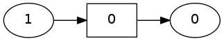
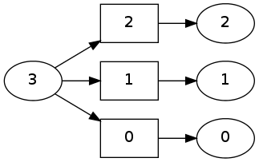
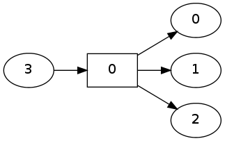

pydecode.ChartBuilder
=====================

.. note::
   This section gives a formal overview of the use of ``ChartBuilder``. For a series of tutorials and practical examples see :doc:`../index`.

.. currentmodule:: pydecode                                            
.. autoclass:: ChartBuilder
   :members: init, set

Examples
--------

.. code:: python

    import pydecode
    import numpy as np
    items = np.arange(10)
.. code:: python

    chart = pydecode.ChartBuilder(items)
    chart.init(items[0])
    chart.set(items[1], 
              [[items[0]]], 
              labels=[0])
    pydecode.draw(chart.finish(), labels=True)

Computes

.. math::  f(w) = (\bar{1} \otimes w(0)) \oplus (\bar{1} \otimes w(1)) \oplus (\bar{1} \otimes w(2)) 

.. code:: python

    chart = pydecode.ChartBuilder(items)
    chart.init(items[0:3])
    chart.set(items[3], 
              [[items[0]], [items[1]], [items[2]]],
              labels=[0,1,2])
    pydecode.draw(chart.finish(), labels=True)

.. image:: ChartBuilder_files/ChartBuilder_9_0.png

Represents

.. math::  f(w) = (\bar{1} \otimes \bar{1} \otimes \bar{1} \otimes w(0)) 

.. code:: python

    chart = pydecode.ChartBuilder(items)
    chart.init(items[0:3])
    chart.set(items[3], 
              [[items[0], items[1], items[2]]],
              labels=[0])
    pydecode.draw(chart.finish(), labels=True)

.. image:: ChartBuilder_files/ChartBuilder_11_0.png

Same functions using ``set_t``.

.. code:: python

    chart = pydecode.ChartBuilder(items)
    chart.init(items[0:3])
    chart.set_t(items[3], items[0:3], labels=np.arange(3))
    pydecode.draw(chart.finish(), labels=True)

.. code:: python

    chart = pydecode.ChartBuilder(items)
    chart.init(items[0:3])
    chart.set_t(items[3], items[[0]], items[[1]], items[[2]],
                labels=np.array([0]))
    pydecode.draw(chart.finish(), labels=True)

A more interesting use of ``set_t``.

.. code:: python

    chart = pydecode.ChartBuilder(items)
    chart.init(items[0:9])
    chart.set_t(items[9], items[0:8], items[1:9], labels=np.arange(8))
    pydecode.draw(chart.finish(), labels=True)

.. image:: ChartBuilder_files/ChartBuilder_16_0.png

