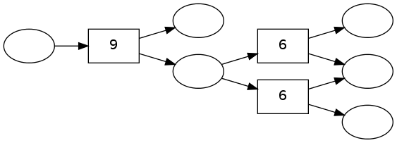
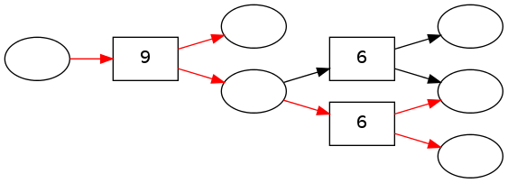

pydecode.best\_path
===================

.. currentmodule:: pydecode                             
.. autofunction:: best_path    

Example
-------

This examples creates a simple hypergraph with random integer weights,
and highlights the best path in the hypergraph.

.. code:: python

    import pydecode
    import pydecode.test.utils
    import numpy as np
    graph = pydecode.test.utils.simple_hypergraph()
    weights = np.random.randint(10, size=(len(graph.edges)))
    pydecode.draw(graph, weights)

.. code:: python

    path = pydecode.best_path(graph, weights * 1.)
    pydecode.draw(graph, weights, paths=[path])

Bibliography
------------

.. bibliography:: ../../full.bib 
   :filter: key in {"younger1967recognition"}
   :style: plain

Invariants
----------

-  Best path is equal to

.. math:: \ *x W*\ {x\_1} W\_{x\_n}

.. code:: python

    import pydecode.test
    @pydecode.test.property(viterbi=True)
    def test_all_paths(graph, weights, weight_type):
        """
        Compare best-path to exhaustive enumeration.
        """
        best_path = pydecode.best_path(graph, weights, weight_type)
        best_score = pydecode.score(best_path, weights, weight_type)
        match = False
        for path in pydecode.test.all_paths(graph):
            score = pydecode.score(path, weights, weight_type)
            assert best_score.value >= score.value
            if path == best_path:
                match = True
                pydecode.test.assert_almost_equal(best_score.value, score.value)
        assert match
    test_all_paths()    