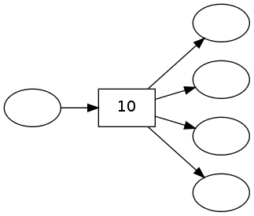
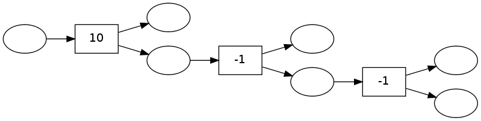

pydecode.binarize
=================

.. currentmodule:: pydecode                             
.. autofunction:: binarize

Examples
--------

.. code:: python

    import pydecode
    import numpy as np
.. code:: python

    items = np.arange(10)
    chart = pydecode.ChartBuilder(items)
    chart.init(items[:4])
    chart.set(items[5], [items[:4]], labels=[10])
    graph = chart.finish()
.. code:: python

    pydecode.draw(graph, graph.labeling, vertex_labels=None)

.. code:: python

    new_graph = pydecode.binarize(graph)
.. code:: python

    pydecode.draw(new_graph, new_graph.labeling, vertex_labels=None)

Invariants
----------

.. code:: python

    import numpy.testing as test
    import pydecode.test.utils as test_utils
    graph, _, weight_type = test_utils.random_setup()
    binary_graph = pydecode.binarize(graph)
    size = np.max(graph.labeling) + 1
    label_weights = test_utils.random_weights(weight_type, size)
Binarizing does not change best path score.

.. code:: python

    weights = pydecode.transform(graph, label_weights, weight_type=weight_type)
    score1 = pydecode.inside(graph, weights, weight_type=weight_type)[graph.root.id]
.. code:: python

    weights2 = pydecode.transform(binary_graph, label_weights, weight_type=weight_type)
    score2 = pydecode.inside(binary_graph, weights2, weight_type=weight_type)[graph.root.id]
.. code:: python

    test.assert_almost_equal(score1, score2)