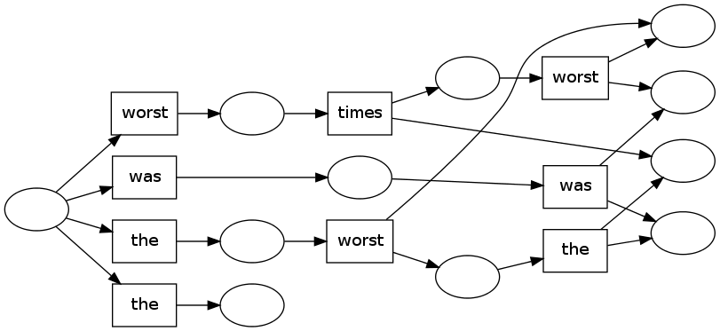
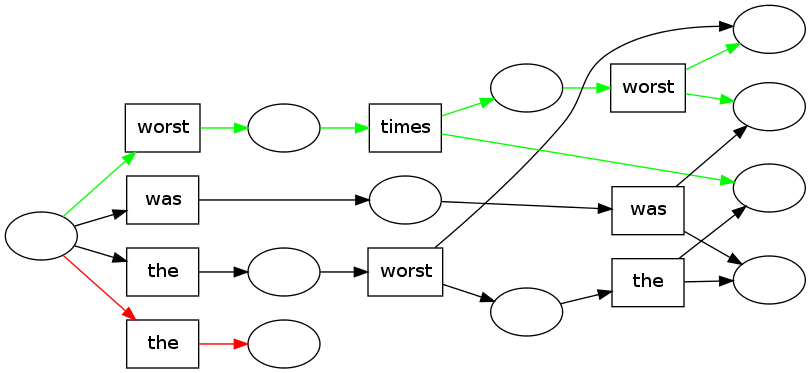
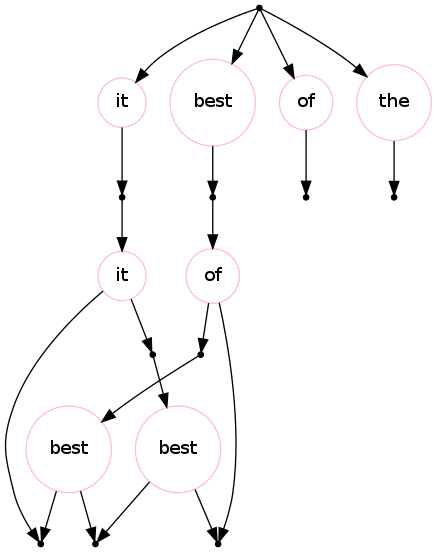

pydecode.draw
=============

.. currentmodule:: pydecode                             
.. autofunction:: draw    

Example
-------

.. code:: python

    import pydecode, pydecode.test
    import numpy as np
    graph = pydecode.test.random_hypergraph(5)
    words = np.array("it was the best of times it was the worst of times".split())
    edge_labels = words[np.random.randint(words.shape[0]-1, size=len(graph.edges))]
    pydecode.draw(graph, edge_labels)

.. code:: python

    path1 = pydecode.test.utils.random_path(graph)
    path2 = pydecode.test.utils.random_path(graph)
    path3 = pydecode.test.utils.random_path(graph)
    pydecode.draw(graph, edge_labels, paths=[path1, path2, path3])

Custom formatters inherit from ``HypergraphFormatter`` in
pydecode.display. These allow you to specify GraphViz properties
directly.

.. code:: python

    from pydecode.display import HypergraphFormatter
    class MyFormatter(HypergraphFormatter):
        def graph_attrs(self):
            return {"rankdir": "TB"}
        def hypernode_attrs(self, vertex):
            return {"shape": "point"}
        def hyperedge_node_attrs(self, edge):
            label = "%s"%(self.edge_labels[edge.id])
            if label[0] == "w":
                color = "blue"
            else:
                color = "pink"
            return {"shape": "circle",
                    "color": color,
                    "label": label}
    
    pydecode.draw(graph, edge_labels, formatter=MyFormatter())

