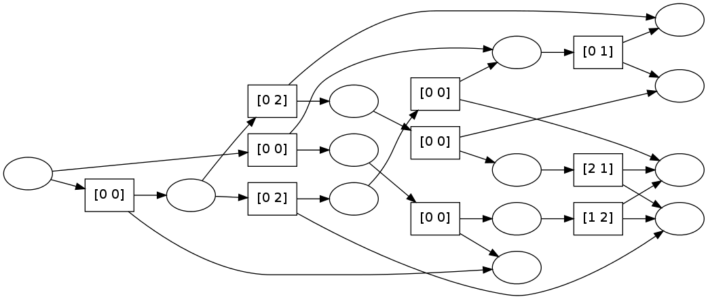

pydecode.nlp.eisner
===================

.. currentmodule:: pydecode.nlp
.. autofunction:: eisner

Example
-------

.. code:: python

    import pydecode, pydecode.nlp, pydecode.test
    import numpy as np
    graph, encoder = pydecode.nlp.eisner(2, order=1)
.. code:: python

    labels = np.array(graph.labeling)
    labels[labels==-1] = 0
    pydecode.draw(graph, encoder.transform_labels(labels))

.. code:: python

    path = pydecode.test.random_path(graph)
    parse = encoder.transform_path(path)
    parse

.. parsed-literal::

    array([-1,  0,  1])

Bibliography
------------

.. bibliography:: ../../full.bib 
   :filter: key in {"eisner1999efficient", "mcdonaldthesis"}
   :style: plain

Invariants
----------

Check that each dependency parse is in the hypergraph.

.. code:: python

    def test_all_paths(sentence_length, order):
        graph, encoder = pydecode.nlp.eisner(sentence_length, order)
    
        # Generate all paths.
        p1 = np.array([encoder.transform_path(path)
                       for path in pydecode.test.all_paths(graph)])
    
        # Generate all parses.
        p2 = np.array([parse 
                       for parse in encoder.all_structures()])
    
        assert (p1[np.lexsort(p1.T)] == p2[np.lexsort(p2.T)]).all()
    
    for length in range(3, 6):
        for order in [1, 2]:
            test_all_paths(length, order)