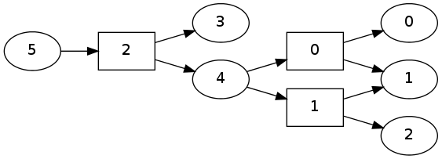
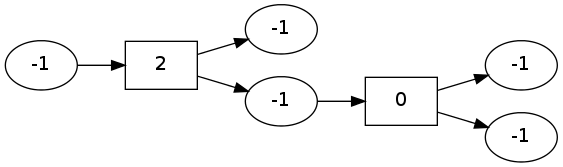

pydecode.filter
===============

.. currentmodule:: pydecode                             
.. autofunction:: filter

Examples
--------

.. code:: python

    import pydecode
    import numpy as np
    import pydecode.test.utils
.. code:: python

    graph = pydecode.test.utils.simple_hypergraph()
    pydecode.draw(graph, labels=True)

.. code:: python

    weights = pydecode.transform(graph, np.array([100, -10, 50]))
    filtered_graph = pydecode.filter(graph, np.array(weights >=0.0, dtype=np.uint8))
.. code:: python

    pydecode.draw(filtered_graph, labels=True)

Invariants
----------

