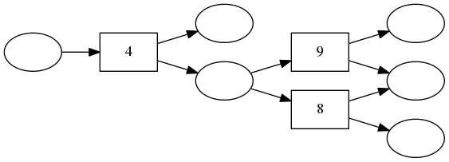
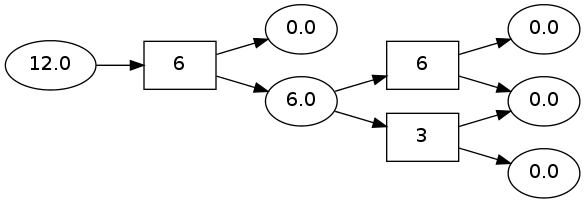
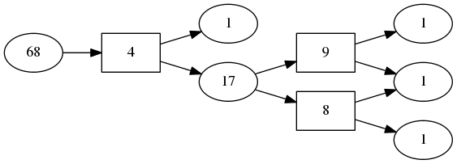
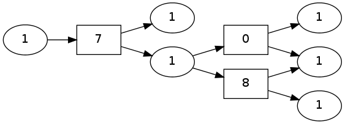

pydecode.inside
===============

.. currentmodule:: pydecode                             
.. autofunction:: inside    

Example
-------

This examples creates a simple hypergraph with random integer weights, and overlays the inside scores onto the graph for several different weight types.

.. code:: python

    import pydecode
    import pydecode.test.utils
    import numpy as np
    graph = pydecode.test.utils.simple_hypergraph()
    weights = np.random.randint(10, size=(len(graph.edges)))
    pydecode.draw(graph, weights)

.. code:: python

    inside = pydecode.inside(graph, np.array(weights, dtype=np.double), 
                    weight_type=pydecode.LogViterbi)
    pydecode.draw(graph, weights, inside)

.. code:: python

    inside = pydecode.inside(graph, np.array(weights, dtype=np.int32), 
                             weight_type=pydecode.Counting)
    pydecode.draw(graph, weights, inside)

.. code:: python

    inside = pydecode.inside(graph, np.array(weights > 5, dtype=np.int8), 
                    weight_type=pydecode.Boolean)
    pydecode.draw(graph, weights, inside)

Invariants
----------

.. code:: python

    import numpy.testing as test
    import pydecode.test.utils as test_utils
    graph, weights, weight_type = test_utils.random_setup()
    inside = pydecode.inside(graph, weights, weight_type=weight_type)
Scores in the chart represent the sum of all inside path.

.. code:: python

    for vertex in graph.vertices:
        if vertex.is_terminal: 
            score = weight_type.Value.one()
        else:
            score = weight_type.Value.zero()
            for path in test_utils.inside_paths(graph, vertex):
                score += test_utils.path_score(path, weights, weight_type)
        test.assert_almost_equal(inside[vertex.id], score.value, 5)
Check that the inside score of a vertex is the sum of its direct children. 

.. code:: python

    inside2 = np.zeros(inside.shape, dtype=np.double)
    inside2.fill(weight_type.Value.zero_raw())
    for vertex in graph.vertices:
        if vertex.is_terminal: 
            inside2[vertex.id] = weight_type.Value.one().value
        else:
            score = weight_type.Value(inside2[vertex.id])
            for edge in vertex.edges:
                temp = [inside[sub.id] for sub in edge.tail] +  [weights[edge.id]]
                score += np.product(map(weight_type.Value, temp))
        inside2[vertex.id] = score.value
    test.assert_almost_equal(inside, inside2, 5)