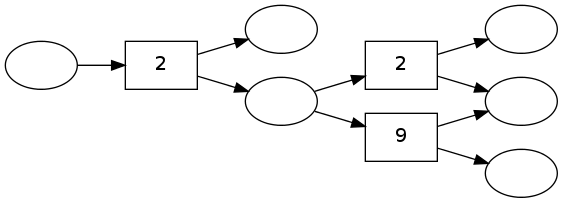
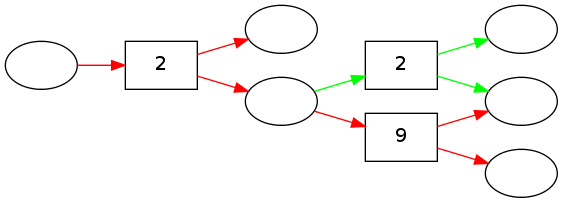

pydecode.kbest
==============

.. currentmodule:: pydecode                             
.. autofunction:: kbest

Example
-------

.. code:: python

    import pydecode, pydecode.test
    graph = pydecode.test.simple_hypergraph()
    weights = np.random.randint(10, size=len(graph.edges))
.. code:: python

    pydecode.draw(graph, weights)

.. code:: python

    paths = pydecode.kbest(graph, 1.*weights, 10)
    weights * paths[0].v, weights * paths[1].v

.. parsed-literal::

    (array([8]), array([6]))

.. code:: python

    pydecode.draw(graph, weights, paths=paths)

Bibliography
------------

.. bibliography:: ../../full.bib 
   :filter: key in {"huang2005better"}
   :style: plain

Invariants
----------

.. code:: python

    
First-best is the same as best-path.

.. code:: python

    @pydecode.test.property(viterbi=True)
    def test_k_first_best(graph, weights, weight_type):
        paths = pydecode.kbest(graph, weights, 5)
        path = pydecode.best_path(graph, weights)
        assert(weights.T * paths[0].v == weights.T * path.v)
        assert(paths[0] == path)
    test_k_first_best()
Check that k-best paths exhaustively.

.. code:: python

    @pydecode.test.property(viterbi=True)
    def test_k_best(graph, weights, weight_type):
        paths = pydecode.kbest(graph, weights, 5)
        k_best_path_scores = []
        for path2 in pydecode.test.all_paths(graph):
            score = pydecode.score(path2, weights, pydecode.LogViterbi)
            k_best_path_scores.append(score.value)
            k_best_path_scores.sort(reverse=True)
            k_best_path_scores = k_best_path_scores[:5]
    
        k_best_scores = [weights.T * path.v for path in paths]
        assert k_best_path_scores == k_best_scores
    test_k_best()