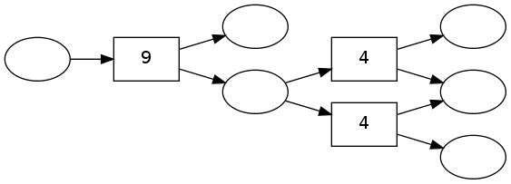
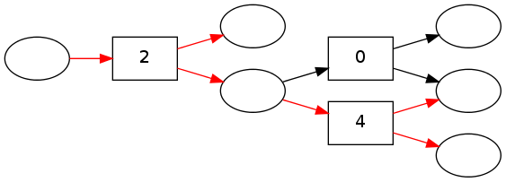

pydecode.lp
===========

.. currentmodule:: pydecode                             
.. autofunction:: lp    

.. currentmodule:: pydecode.lp                             
.. autoclass:: HypergraphLP

Examples
--------

.. code:: python

    import pydecode
    import pydecode.test.utils as test_utils
    import numpy as np
.. code:: python

    graph = test_utils.simple_hypergraph()
    weights = np.random.randint(10, size=len(graph.edges))
    pydecode.draw(graph, weights)

.. code:: python

    linear_program = pydecode.lp(graph, weights * 1.)
    linear_program.solve()
    pydecode.draw(graph, weights, paths=[linear_program.path])

.. code:: python

    print linear_program.lp

.. parsed-literal::

    Hypergraph Problem:
    MAXIMIZE
    4.0*edge_0 + 2.0*edge_2 + 0.0
    SUBJECT TO
    _C1: node_5 = 1
    
    _C2: - edge_0 - edge_1 + node_4 = 0
    
    _C3: - edge_2 + node_5 = 0
    
    _C4: - edge_0 + node_0 = 0
    
    _C5: - edge_0 - edge_1 + node_1 = 0
    
    _C6: - edge_1 + node_2 = 0
    
    _C7: - edge_2 + node_3 = 0
    
    _C8: - edge_2 + node_4 = 0
    
    _C9: - edge_2 + label_0 = 0
    
    _C10: - edge_2 + label_1 = 0
    
    _C11: - edge_2 + label_2 = 0
    
    VARIABLES
    edge_0 <= 1 Continuous
    edge_1 <= 1 Continuous
    edge_2 <= 1 Continuous
    label_0 <= 1 Continuous
    label_1 <= 1 Continuous
    label_2 <= 1 Continuous
    node_0 <= 1 Continuous
    node_1 <= 1 Continuous
    node_2 <= 1 Continuous
    node_3 <= 1 Continuous
    node_4 <= 1 Continuous
    node_5 <= 1 Continuous
    

Invariants
----------

Check that linear program always gives the same result as best path.

.. code:: python

    import numpy.testing as test
    import pydecode.test.utils as test_utils
    graph = test_utils.random_hypergraph()
    weights = test_utils.random_weights(pydecode.LogViterbi, len(graph.edges))
    best_path = pydecode.best_path(graph, weights)
    best_path_score = best_path.v.T * weights
.. code:: python

    linear_program = pydecode.lp(graph, weights)
    linear_program.solve()
    assert linear_program.path == best_path
    assert best_path_score == linear_program.objective