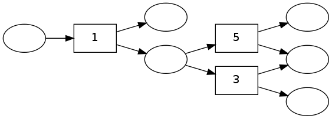
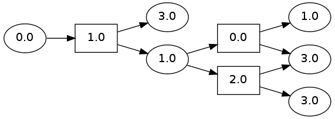
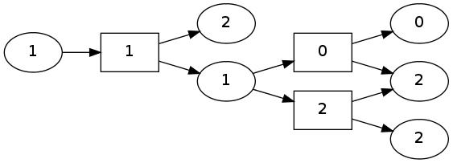
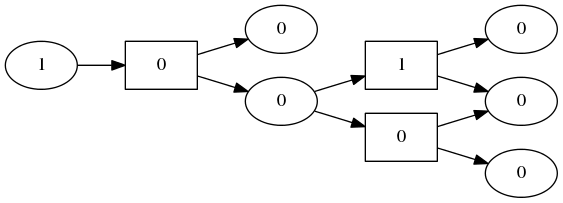

pydecode.outside
================

.. currentmodule:: pydecode                             
.. autofunction:: outside    

Example
-------

This examples creates a simple hypergraph with random integer weights,
and overlays the outside scores onto the graph for several different
weight types.

.. code:: python

    import pydecode
    import pydecode.test.utils
    import numpy as np
    graph = pydecode.test.utils.simple_hypergraph()
    weights = np.random.randint(10, size=(len(graph.edges)))
    pydecode.draw(graph, weights)

.. code:: python

    def show_outside(weights, weight_type):
        inside = pydecode.inside(graph, weights, weight_type=weight_type)
        outside = pydecode.outside(graph, weights, inside, weight_type=weight_type)
        return pydecode.draw(graph, weights, outside)

.. code:: python

    show_outside(np.array(weights, dtype=np.double), pydecode.LogViterbi)

.. code:: python

    show_outside(np.array(weights, dtype=np.int32), pydecode.Counting)

.. code:: python

    show_outside(np.array(weights > 5, dtype=np.int8), pydecode.Boolean)

Invariants
----------

.. code:: python

    import numpy.testing as test
    import pydecode.test.utils as test_utils
    graph, weights, weight_type = test_utils.random_setup()
    
    inside = pydecode.inside(graph, weights, weight_type=weight_type)
    outside = pydecode.outside(graph, weights, inside, weight_type=weight_type)
Scores in the chart represent the sum of all outside paths.

.. code:: python

    for vertex in graph.vertices:
        if vertex.id == graph.root.id: 
            score = weight_type.Value.one()
        else:
            score = weight_type.Value.zero()
            for path in test_utils.outside_paths(graph, vertex):
                score += test_utils.path_score(path, weights, weight_type)
        test.assert_almost_equal(outside[vertex.id], score.value, 5)