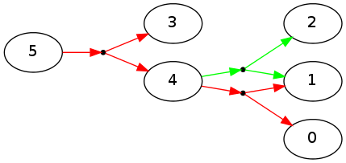
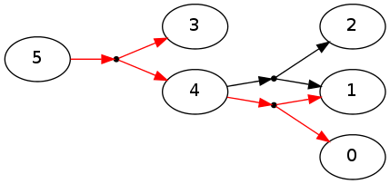

pydecode.outside
================

.. currentmodule:: pydecode                             
.. autofunction:: outside    

Example
-------

This examples creates a simple hypergraph with random integer weights,
and overlays the outside scores onto the graph for several different
weight types.

.. code:: python

    import pydecode, pydecode.test
    import numpy as np
    graph = pydecode.test.simple_hypergraph()
    weights = np.random.randint(10, size=(len(graph.edges)))
    pydecode.draw(graph, weights)

.. image:: outside_files/outside_4_0.png

.. code:: python

    def show_outside(weights, weight_type):
        inside = pydecode.inside(graph, weights, weight_type=weight_type)
        outside = pydecode.outside(graph, weights, inside, weight_type=weight_type)
        return pydecode.draw(graph, weights, outside)
.. code:: python

    show_outside(np.array(weights, dtype=np.double), pydecode.LogViterbi)

.. image:: outside_files/outside_6_0.png

.. code:: python

    show_outside(np.array(weights, dtype=np.int32), pydecode.Counting)

.. image:: outside_files/outside_7_0.png

.. code:: python

    show_outside(np.array(weights > 5, dtype=np.int8), pydecode.Boolean)

.. image:: outside_files/outside_8_0.png

.. code:: python

    paths_0 = pydecode.test.outside_paths(graph, graph.vertices[0])
    paths_1 = pydecode.test.outside_paths(graph, graph.vertices[1])
    

.. code:: python

    pydecode.draw(graph, None, np.arange(len(graph.vertices)), paths=paths_1)

.. code:: python

    pydecode.draw(graph, None, np.arange(len(graph.vertices)), paths=paths_0)

Invariants
----------

Scores in the chart represent the sum of all outside paths.

.. code:: python

    @pydecode.test.property()
    def test_all_outside_paths(graph, weights, weight_type):
        # Compute inside and outside.
        inside = pydecode.inside(graph, weights, weight_type=weight_type)
        outside = pydecode.outside(graph, weights, inside, weight_type=weight_type)
    
        # Enumerate paths. 
        outside2 = np.zeros(outside.shape, dtype=np.double)
        for vertex in graph.vertices:
            if vertex.id == graph.root.id: 
                score = weight_type.one()
            else:
                score = weight_type.zero()
                for path in pydecode.test.outside_paths(graph, vertex):
                    score = score + pydecode.score(path, weights, weight_type)
            outside2[vertex.id] = score.value
            pydecode.test.assert_almost_equal(outside[vertex.id],
                                              score.value)
        pydecode.test.assert_almost_equal(outside,
                                          outside2)
    test_all_outside_paths()
.. code:: python

    @pydecode.test.property()
    def test_outside_paths(graph, weights, weight_type):
        counts = np.ones(len(graph.edges), dtype=np.int32)
        inside = pydecode.inside(graph, counts, weight_type=pydecode.Counting)
        outside = pydecode.outside(graph, counts, inside, weight_type=pydecode.Counting)
        assert len(list(pydecode.test.all_paths(graph))) == inside[graph.root.id]
        
        for vertex in graph.vertices:
            assert inside[vertex.id] == len(list(pydecode.test.inside_paths(graph, vertex)))
    
        for vertex in graph.vertices:
            assert outside[vertex.id] == len(list(pydecode.test.outside_paths(graph, vertex)))
    test_outside_paths()