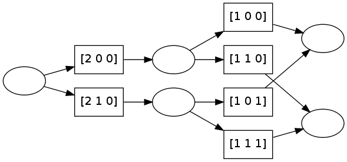

pydecode.nlp.tagger
===================

.. currentmodule:: pydecode.nlp
.. autofunction:: tagger

Example
-------

.. code:: python

    import pydecode, pydecode.nlp, pydecode.test
    graph, encoder = pydecode.nlp.tagger(3, [2, 2, 1], order=1)
.. code:: python

    graph.labeling

.. parsed-literal::

    array([ 4,  6,  5,  7,  8, 10], dtype=int32)

.. code:: python

    pydecode.draw(graph, encoder.transform_labels(graph.labeling))

Bibliography
------------

Invariants
----------

Try all possible taggings.

.. code:: python

    import pydecode
    import numpy as np
    def test_all_paths(sentence_length):
        K = [10] * (sentence_length-1) + [1]
        graph, encoder = pydecode.nlp.tagger(sentence_length, K)
    
        # Generate all paths.
        p1 = np.array([encoder.transform_path(path)
                       for path in pydecode.test.all_paths(graph)])
    
        # Generate all parses.
        p2 = np.array([parse 
                       for parse in encoder.all_structures()])
    
        assert (p1[np.lexsort(p1.T)] == p2[np.lexsort(p2.T)]).all()
    
    for i in range(2, 6):
        test_all_paths(i)