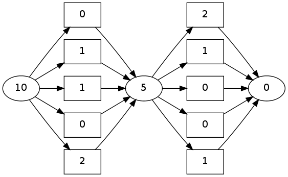
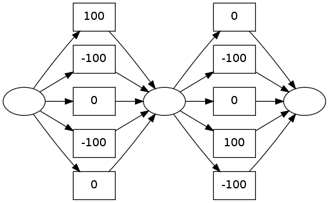

pydecode.transform
==================

.. currentmodule:: pydecode                             
.. autofunction:: transform    

.. currentmodule:: pydecode                             
.. autofunction:: inverse_transform

Examples
--------

.. code:: python

    import pydecode
    import numpy as np
.. code:: python

    items = np.arange(11)
    chart = pydecode.ChartBuilder(items)
    chart.init(items[0])
    chart.set(items[5], [[0] for i in range(5)], np.arange(5) % 3)
    chart.set(items[10], [[5] for i in range(5)], np.arange(5) % 3)
    graph = chart.finish()
    pydecode.draw(graph, labels=True)

.. code:: python

    values = np.array([-100, 0, 100])
    weights = pydecode.transform(graph, values)
    pydecode.draw(graph, weights)

.. code:: python

    marginals = pydecode.marginals(graph, values * 1.)
    print pydecode.inverse_transform(graph, marginals)

.. parsed-literal::

    [ 100.  100.  100.]

Invariants
----------

Check that the transforms are invertible.

.. code:: python

    import numpy.testing as test
    import pydecode.test.utils as test_utils
    graph, _, weight_type = test_utils.random_setup()
    size = np.max(graph.labeling) + 1
    label_weights = test_utils.random_weights(weight_type, size)
.. code:: python

    weights = pydecode.transform(graph, label_weights, weight_type=weight_type)
Weight transform.

.. code:: python

    weights2 = np.zeros(len(graph.edges))
    weights2.fill(weight_type.Value.one_raw())
    for i, label in enumerate(graph.labeling):
        if label == -1: continue
        weights2[i] = label_weights[label]
    test.assert_almost_equal(weights, weights2, 5)
Reverse transform.

.. code:: python

    weights = test_utils.random_weights(weight_type, len(graph.edges))
    label_weights = pydecode.inverse_transform(graph, weights, weight_type=weight_type)
.. code:: python

    label_weights2 = [weight_type.Value.zero()] * size
    for i, label in enumerate(graph.labeling):
        if label == -1: continue
        label_weights2[label] += weight_type.Value(weights[i])
    label_weights2 = np.array([weight.value for weight in label_weights2])
    test.assert_almost_equal(label_weights, label_weights2, 5)