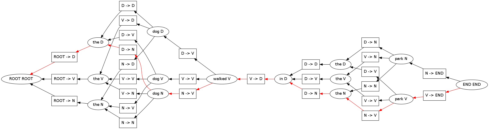

.. code:: python

    import pydecode.hyper as ph
    import pydecode.display as display
    from collections import namedtuple
    
    import pydecode.chart as chart
    import pydecode.semiring as semi
    import pandas as pd
A HMM Tagger Example
--------------------

We begin by constructing the HMM probabilities.

.. code:: python

    # The emission probabilities.
    emission = {'ROOT' : {'ROOT' : 1.0},
                'the' :  {'D': 0.8, 'N': 0.1, 'V': 0.1},
                'dog' :  {'D': 0.1, 'N': 0.8, 'V': 0.1},
                'walked':{'V': 1},
                'in' :   {'D': 1},
                'park' : {'N': 0.1, 'V': 0.9},
                'END' :  {'END' : 1.0}}
    
    # The transition probabilities.
    transition = {'D' :    {'D' : 0.1, 'N' : 0.8, 'V' : 0.1, 'END' : 0},
                  'N' :    {'D' : 0.1, 'N' : 0.1, 'V' : 0.8, 'END' : 0},
                  'V' :    {'D' : 0.4, 'N' : 0.3, 'V' : 0.3, 'END' : 0},
                  'ROOT' : {'D' : 0.4, 'N' : 0.3, 'V' : 0.3}}
.. code:: python

    pd.DataFrame(transition).fillna(0) 

.. raw:: html

    

    <table border="1" class="dataframe">
      <thead>
        <tr style="text-align: right;">
          <th></th>
          <th>D</th>
          <th>N</th>
          <th>ROOT</th>
          <th>V</th>
        </tr>
      </thead>
      <tbody>
        <tr>
          <th>D</th>
          <td> 0.1</td>
          <td> 0.1</td>
          <td> 0.4</td>
          <td> 0.4</td>
        </tr>
        <tr>
          <th>END</th>
          <td> 0.0</td>
          <td> 0.0</td>
          <td> 0.0</td>
          <td> 0.0</td>
        </tr>
        <tr>
          <th>N</th>
          <td> 0.8</td>
          <td> 0.1</td>
          <td> 0.3</td>
          <td> 0.3</td>
        </tr>
        <tr>
          <th>V</th>
          <td> 0.1</td>
          <td> 0.8</td>
          <td> 0.3</td>
          <td> 0.3</td>
        </tr>
      </tbody>
    </table>
    

.. code:: python

    pd.DataFrame(emission).fillna(0)

.. raw:: html

    

    <table border="1" class="dataframe">
      <thead>
        <tr style="text-align: right;">
          <th></th>
          <th>END</th>
          <th>ROOT</th>
          <th>dog</th>
          <th>in</th>
          <th>park</th>
          <th>the</th>
          <th>walked</th>
        </tr>
      </thead>
      <tbody>
        <tr>
          <th>D</th>
          <td> 0</td>
          <td> 0</td>
          <td> 0.1</td>
          <td> 1</td>
          <td> 0.0</td>
          <td> 0.8</td>
          <td> 0</td>
        </tr>
        <tr>
          <th>END</th>
          <td> 1</td>
          <td> 0</td>
          <td> 0.0</td>
          <td> 0</td>
          <td> 0.0</td>
          <td> 0.0</td>
          <td> 0</td>
        </tr>
        <tr>
          <th>N</th>
          <td> 0</td>
          <td> 0</td>
          <td> 0.8</td>
          <td> 0</td>
          <td> 0.1</td>
          <td> 0.1</td>
          <td> 0</td>
        </tr>
        <tr>
          <th>ROOT</th>
          <td> 0</td>
          <td> 1</td>
          <td> 0.0</td>
          <td> 0</td>
          <td> 0.0</td>
          <td> 0.0</td>
          <td> 0</td>
        </tr>
        <tr>
          <th>V</th>
          <td> 0</td>
          <td> 0</td>
          <td> 0.1</td>
          <td> 0</td>
          <td> 0.9</td>
          <td> 0.1</td>
          <td> 1</td>
        </tr>
      </tbody>
    </table>
    

Next we specify the labels for the transitions.

.. code:: python

    class Bigram(namedtuple("Bigram", ["word", "tag", "prevtag"])):
        def __str__(self): return "%s -> %s"%(self.prevtag, self.tag)
    
    class Tagged(namedtuple("Tagged", ["position", "word", "tag"])):
        def __str__(self): return "%s %s"%(self.word, self.tag)
    

And the scoring function.

.. code:: python

    def bigram_weight(bigram):
        return transition[bigram.prevtag][bigram.tag] + \
        emission[bigram.word][bigram.tag] 
Now we write out dynamic program.

.. code:: python

    def viterbi(chart):
        words = ["ROOT"] + sentence.strip().split(" ") + ["END"]
        c.init(Tagged(0, "ROOT", "ROOT"))    
        for i, word in enumerate(words[1:], 1):
            prev_tags = emission[words[i-1]].keys()
            for tag in emission[word].iterkeys():
                c[Tagged(i, word, tag)] = \
                    c.sum([c[key] * c.sr(Bigram(word, tag, prev)) 
                           for prev in prev_tags 
                           for key in [Tagged(i - 1, words[i - 1], prev)] 
                           if key in c])
        return c
Now we are ready to build the structure itself.

.. code:: python

    # The sentence to be tagged.
    sentence = 'the dog walked in the park'
.. code:: python

    # Create a chart using to compute the probability of the sentence.
    c = chart.ChartBuilder(bigram_weight)
    viterbi(c).finish()

.. parsed-literal::

    10.600000000000001

.. code:: python

    # Create a chart to compute the max paths.
    c = chart.ChartBuilder(bigram_weight, 
                           chart.ViterbiSemiRing)
    viterbi(c).finish()

.. parsed-literal::

    9.600000000000001

But even better we can construct the entrire search space.

.. code:: python

    c = chart.ChartBuilder(lambda a:a, semi.HypergraphSemiRing, 
                           build_hypergraph = True)
    hypergraph = viterbi(c).finish()
.. code:: python

    weights = ph.Weights(hypergraph).build(bigram_weight)
    
    # Find the best path.
    path = ph.best_path(hypergraph, weights)
    print weights.dot(path)

.. parsed-literal::

    9.6

We can also output the path itself.

.. code:: python

    print [hypergraph.label(edge) for edge in path.edges]

.. parsed-literal::

    [Bigram(word='the', tag='D', prevtag='ROOT'), Bigram(word='dog', tag='N', prevtag='D'), Bigram(word='walked', tag='V', prevtag='N'), Bigram(word='in', tag='D', prevtag='V'), Bigram(word='the', tag='N', prevtag='D'), Bigram(word='park', tag='V', prevtag='N'), Bigram(word='END', tag='END', prevtag='V')]

.. code:: python

    display.HypergraphPathFormatter(hypergraph, [path]).to_ipython()

We can also use a custom fancier formatter. These attributes are from
graphviz (http://www.graphviz.org/content/attrs)

.. code:: python

    class HMMFormat(display.HypergraphPathFormatter):
        def hypernode_attrs(self, node):
            label = self.hypergraph.node_label(node)
            return {"label": label.tag, "shape": ""}
        def hyperedge_node_attrs(self, edge):
            return {"color": "pink", "shape": "point"}
        def hypernode_subgraph(self, node):
            label = self.hypergraph.node_label(node)
            return [("cluster_" + str(label.position), None)]
        def subgraph_format(self, subgraph):
            return {"label": (["ROOT"] + sentence.split() + ["END"])[int(subgraph.split("_")[1])],
                    "rank" : "same"}
        def graph_attrs(self): return {"rankdir":"RL"}
    
    HMMFormat(hypergraph, [path]).to_ipython()

.. image:: hmm_files/hmm_23_0.png

PyDecode also allows you to add extra constraints to the problem. As an
example we can add constraints to enfore that the tag of "dog" is the
same tag as "park".

.. code:: python

    def cons(tag): return "tag_%s"%tag
    
    def build_constraints(bigram):
        if bigram.word == "dog":
            return [(cons(bigram.tag), 1)]
        elif bigram.word == "park":
            return [(cons(bigram.tag), -1)]
        return []
    
    constraints = \
        ph.Constraints(hypergraph).build( 
                       [(cons(tag), 0) for tag in ["D", "V", "N"]], 
                       build_constraints)
This check fails because the tags do not agree.

.. code:: python

    print "check", constraints.check(path)

.. parsed-literal::

    check [<pydecode.hyper.Constraint object at 0x261dd90>, <pydecode.hyper.Constraint object at 0x36e9190>]

Solve instead using subgradient.

.. code:: python

    gpath, duals = ph.best_constrained(hypergraph, weights, constraints)
.. code:: python

    for d in duals:
        print d.dual, d.constraints

.. parsed-literal::

    9.6 [<pydecode.hyper.Constraint object at 0x261dd90>, <pydecode.hyper.Constraint object at 0x36e9190>]
    8.8 []

.. code:: python

    display.report(duals)

.. image:: hmm_files/hmm_31_0.png

.. code:: python

    import pydecode.lp as lp
    hypergraph_lp = lp.HypergraphLP.make_lp(hypergraph, weights)
    hypergraph_lp.solve()
    path = hypergraph_lp.path
.. code:: python

    # Output the path.
    for edge in gpath.edges:
        print hypergraph.label(edge)

.. parsed-literal::

    ROOT -> D
    D -> N
    N -> V
    V -> D
    D -> D
    D -> N
    N -> END

.. code:: python

    print "check", constraints.check(gpath)
    print "score", weights.dot(gpath)

.. parsed-literal::

    check []
    score 8.8

.. code:: python

    HMMFormat(hypergraph, [path, gpath]).to_ipython()

.. image:: hmm_files/hmm_35_0.png

.. code:: python

    for constraint in constraints:
        print constraint.label

.. parsed-literal::

    tag_D
    tag_V
    tag_N

.. code:: python

    class HMMConstraintFormat(display.HypergraphConstraintFormatter):
        def hypernode_attrs(self, node):
            label = self.hypergraph.node_label(node)
            return {"label": label.tag, "shape": ""}
        def hyperedge_node_attrs(self, edge):
            return {"color": "pink", "shape": "point"}
        def hypernode_subgraph(self, node):
            label = self.hypergraph.node_label(node)
            return [("cluster_" + str(label.position), None)]
        def subgraph_format(self, subgraph):
            return {"label": (["ROOT"] + sentence.split() + ["END"])[int(subgraph.split("_")[1])]}
    
    HMMConstraintFormat(hypergraph, constraints).to_ipython()

.. image:: hmm_files/hmm_37_0.png

Pruning

.. code:: python

    pruned_hypergraph, pruned_weights = ph.prune_hypergraph(hypergraph, weights, 0.8)
.. code:: python

    HMMFormat(pruned_hypergraph, []).to_ipython()

.. image:: hmm_files/hmm_40_0.png

.. code:: python

    very_pruned_hypergraph, _ = ph.prune_hypergraph(hypergraph, weights, 0.9)