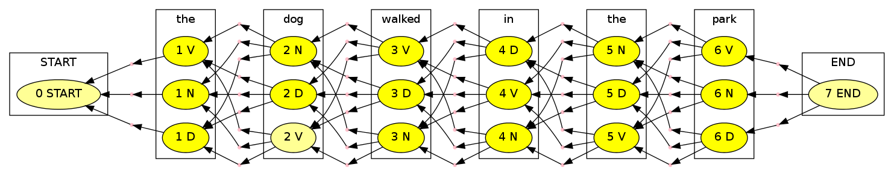

Tutorial 3: HMM Tagger
======================

This tutorial extends edit distance to a richer decoding problem,
part-of-speech tagging.

.. code:: python

    import pydecode
    import pandas as pd
    import matplotlib.pyplot as plt
    import numpy as np
For this example, we assume a toy part-of-speech tagging model. Our
model will be a simple bigram hidden Markov model, with boundary states
START and END.

.. code:: python

    tags = ["START", "D", "N", "V", "END"]
    
    # The emission probabilities.
    emission = {'START' : {'START' : 1.0},
                'the' :  {'D': 0.8, 'N': 0.1, 'V': 0.1},
                'dog' :  {'D': 0.1, 'N': 0.8, 'V': 0.1},
                'walked':{'V': 1},
                'in' :   {'D': 1},
                'park' : {'N': 0.1, 'V': 0.9},
                'END' :  {'END' : 1.0}}
    
    # The transition probabilities.
    transition = {'D' :    {'D' : 0.1, 'N' : 0.8, 'V' : 0.1, 'END' : 0},
                  'N' :    {'D' : 0.1, 'N' : 0.1, 'V' : 0.6, 'END' : 0.2},
                  'V' :    {'D' : 0.4, 'N' : 0.3, 'V' : 0.2, 'END' : 0.1},
                  'START' : {'D' : 0.4, 'N' : 0.3, 'V' : 0.3},
                  'END': {'END' : 1.0}}
    T = pd.DataFrame(transition).fillna(0) 
    E = pd.DataFrame(emission).fillna(0)
    print T
    print E

.. parsed-literal::

           D  END    N  START    V
    D    0.1    0  0.1    0.4  0.4
    END  0.0    1  0.2    0.0  0.1
    N    0.8    0  0.1    0.3  0.3
    V    0.1    0  0.6    0.3  0.2
           END  START  dog  in  park  the  walked
    D        0      0  0.1   1   0.0  0.8       0
    END      1      0  0.0   0   0.0  0.0       0
    N        0      0  0.8   0   0.1  0.1       0
    START    0      1  0.0   0   0.0  0.0       0
    V        0      0  0.1   0   0.9  0.1       1

Here is the PyDecode implementation of the Viterbi algorithm for
tagging.

.. code:: python

    def ungrid(items, shape):
        return np.array(np.unravel_index(items, shape)).T
.. code:: python

    def viterbi(n):
        t = len(tags)
        # Initialization.
        items = np.arange(n * t).reshape([n, t])
        outputs = np.arange(n * t * t).reshape([n, t, t])
        c = pydecode.ChartBuilder(items, outputs)
        
        # The tags allowed at each position.
        K = [[0]] + [range(1, t-1)] * (n-2) + [[t-1]]
    
        # Viterbi.
        c.init(items[0, K[0]])
        for i in range(1, n):
            for t in K[i]:
                c.set_t(items[i, t],
                        items[i-1, K[i-1]],
                        labels=outputs[i, t, K[i-1]])
        return c.finish()
.. code:: python

    # A sentence to be tagged.
    sentence = 'START the dog walked in the park END'.split()
    n = len(sentence)
    graph = viterbi(n)
.. code:: python

    # vertex_labels = pydecode.vertex_items(dp)
    # display.HypergraphFormatter(dp.hypergraph, vertex_labels=vertex_labels, show_hyperedges=False).to_ipython()
    pydecode.draw(graph, None, ungrid(graph.node_labeling, shape=(n,len(tags))))

.. image:: hmm_files/hmm_9_0.png

To make the scores we again compute a value for each of the possible
outputs.

.. code:: python

    def make_scores(words, n_tags):
        n = len(words)
        shape = (n, n_tags, n_tags)
        scores = np.zeros(shape)
        for i, tag, prev_tag in np.ndindex(shape):
            scores[i, tag, prev_tag] = \
                transition[tags[prev_tag]].get(tags[tag], 0.0) * \
                emission[words[i]].get(tags[tag], 0.0)
        return scores
    scores = make_scores(sentence, len(tags))
    weights = pydecode.transform(graph, scores)
.. code:: python

    path = pydecode.best_path(graph, weights, weight_type=pydecode.Viterbi)
    path

.. parsed-literal::

    <pydecode._pydecode.Path at 0x434a2c0>

.. code:: python

    inside = pydecode.inside(graph, weights, weight_type=pydecode.Real)
    root_prob = inside[graph.root.id]
    marginals = pydecode.marginals(graph, weights, weight_type=pydecode.Real, 
                                   inside_chart=inside)
    normalized_marginals = marginals / root_prob
.. code:: python

    m = min(normalized_marginals)
    M = max(normalized_marginals)
    import pydecode.display
    class HMMFormat(pydecode.display.HypergraphPathFormatter):
        def label(self, node):
            label = self.vertex_labels[node.id]
            return "%d %s"%(label[0], tags[label[1]])
        def hyperedge_node_attrs(self, edge):
            return {"color": "pink", "shape": "point"}
        def hypernode_subgraph(self, node):
            return [("cluster_" + str(self.vertex_labels[node.id][0]), None)]
        def subgraph_format(self, subgraph):
            return {"label": (sentence)[int(subgraph.split("_")[1])],
                    "rank" : "same"}
        def graph_attrs(self): return {"rankdir":"RL"}
    
        def hypernode_attrs(self, node):
            return {"shape": "",
                    "label": self.label(node),
                    "style": "filled",
                    "fillcolor": "#FFFF%d"%(int(((normalized_marginals[node.id] - m) / (M-m)) * 100))}
    
    pydecode.draw(graph, None, ungrid(graph.node_labeling, shape=(n,len(tags))), 
                  formatter=HMMFormat(graph))

.. code:: python

    tags

.. parsed-literal::

    ['START', 'D', 'N', 'V', 'END']

.. code:: python

    