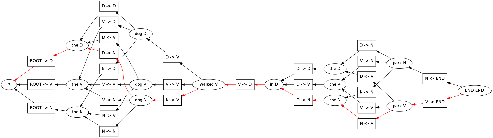

A Simple HMM Example
====================

.. code:: python

    %load_ext autoreload
    %autoreload 2

.. parsed-literal::

    The autoreload extension is already loaded. To reload it, use:
      %reload_ext autoreload

.. code:: python

    import pydecode.hyper as d
    import networkx as nx
    import matplotlib.pyplot as plt

Step 1: Construct the HMM probabilities.

.. code:: python

    # The emission probabilities.
    emission = {'the' :  {'D': 0.8, 'N': 0.1, 'V': 0.1},
                'dog' :  {'D': 0.1, 'N': 0.8, 'V': 0.1},
                'walked' : {'V': 1},
                'in' :   {'D': 1},
                'park' : {'N': 0.1, 'V': 0.9},
                'END' :  {'END' : 0}}
          
    
    # The transition probabilities.
    transition = {'D' :    {'D' : 0.1, 'N' : 0.8, 'V' : 0.1, 'END' : 0},
                  'N' :    {'D' : 0.1, 'N' : 0.1, 'V' : 0.8, 'END' : 0},
                  'V' :    {'D' : 0.4, 'N' : 0.3, 'V' : 0.3, 'END' : 0},
                  'ROOT' : {'D' : 0.4, 'N' : 0.3, 'V' : 0.3}}
    
    # The sentence to be tagged.
    sentence = 'the dog walked in the park'
Step 2: Construct the hypergraph topology.

.. code:: python

    hypergraph = d.Hypergraph()                      
    with hypergraph.builder() as b:
        node_start = b.add_node()
        node_list = [(node_start, "ROOT")]
        words = sentence.strip().split(" ") + ["END"]
            
        for word in words:
            next_node_list = []
            for tag in emission[word].iterkeys():
                edges = (([prev_node], (word, tag, prev_tag))
                         for prev_node, prev_tag in node_list)
                node = b.add_node(edges)
                next_node_list.append((node, tag))
            node_list = next_node_list
Step 3: Construct the weights.

.. code:: python

    def build_weights((word, tag, prev_tag)):
        return transition[prev_tag][tag] + emission[word][tag] 
    weights = d.Weights(hypergraph, build_weights)
.. code:: python

    # Find the viterbi path.
    path, chart = d.best_path(hypergraph, weights)
    print weights.dot(path)
    
    # Output the path.
    for edge in path.edges():
        print hypergraph.type(edge)

.. parsed-literal::

    8.6
    ('the', 'D', 'ROOT')
    ('dog', 'N', 'D')
    ('walked', 'V', 'N')
    ('in', 'D', 'V')
    ('the', 'N', 'D')
    ('park', 'V', 'N')
    ('END', 'END', 'V')

.. code:: python

    import pydecode.display as display
    from IPython.display import Image

.. code:: python

    temp_file = "/tmp/tmp.png"  
    display.to_image(hypergraph, temp_file)
    Image(filename = temp_file, height = 10)

Step 4: Add the constraints.

.. code:: python

    # The tag of "dog" is the same tag as "park".
    constraints = d.Constraints(hypergraph)
    for cons_tag in ["D", "V", "N"]:
        def constraint((word, tag, prev_tag)):
            if cons_tag != tag: return 0
            return {"dog" : 1, "park" : -1}.get(word, 0) 
        constraints.add("tag_" + cons_tag, constraint, 0)
This check fails because the tags do not agree.

.. code:: python

    print "check", constraints.check(path)

.. parsed-literal::

    check ['tag_V', 'tag_N']

Solve instead using subgradient.

.. code:: python

    gpath = d.best_constrained(hypergraph, weights, constraints)
.. code:: python

    # Output the path.
    for edge in gpath.edges():
        print hypergraph.type(edge)

.. parsed-literal::

    ('the', 'D', 'ROOT')
    ('dog', 'N', 'D')
    ('walked', 'V', 'N')
    ('in', 'D', 'V')
    ('the', 'D', 'D')
    ('park', 'N', 'D')
    ('END', 'END', 'N')

.. code:: python

    print "check", constraints.check(gpath)
    print "score", weights.dot(gpath)

.. parsed-literal::

    check []
    score 7.8

