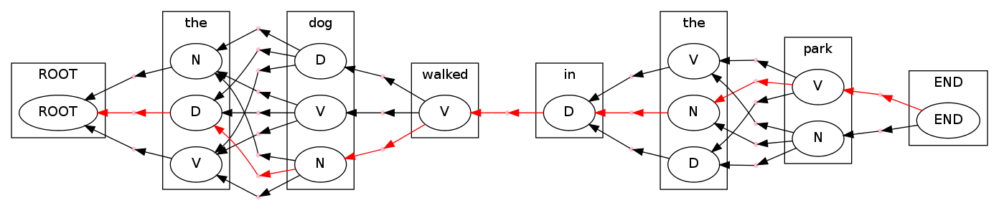
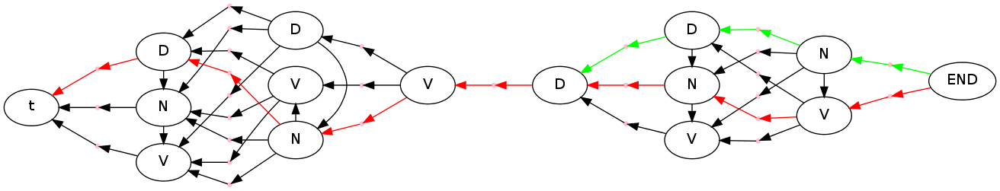
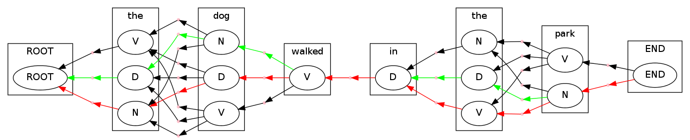
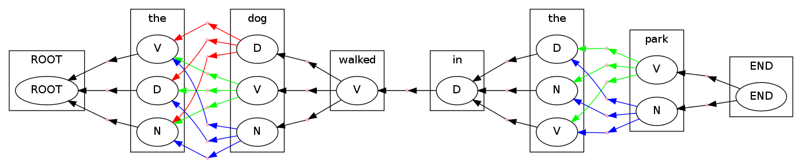

.. code:: python

    import pydecode.hyper as ph
    import pydecode.display as display
    from collections import namedtuple
    import pydecode.chart as chart
A HMM Tagger Example
--------------------

In this example.

Construction

We begin by constructing the HMM probabilities.

.. code:: python

    # The emission probabilities.
    emission = {'ROOT' : {'ROOT' : 1.0},
                'the' :  {'D': 0.8, 'N': 0.1, 'V': 0.1},
                'dog' :  {'D': 0.1, 'N': 0.8, 'V': 0.1},
                'walked':{'V': 1},
                'in' :   {'D': 1},
                'park' : {'N': 0.1, 'V': 0.9},
                'END' :  {'END' : 1.0}}
    
    # The transition probabilities.
    transition = {'D' :    {'D' : 0.1, 'N' : 0.8, 'V' : 0.1, 'END' : 0},
                  'N' :    {'D' : 0.1, 'N' : 0.1, 'V' : 0.8, 'END' : 0},
                  'V' :    {'D' : 0.4, 'N' : 0.3, 'V' : 0.3, 'END' : 0},
                  'ROOT' : {'D' : 0.4, 'N' : 0.3, 'V' : 0.3}}
    
    # The sentence to be tagged.
    sentence = 'the dog walked in the park'
Next we specify the the index set using namedtuples.

.. code:: python

    class Bigram(namedtuple("Bigram", ["word", "tag", "prevtag"])):
        def __str__(self): return "%s -> %s"%(self.prevtag, self.tag)
    
    class Tagged(namedtuple("Tagged", ["position", "word", "tag"])):
        def __str__(self): return "%s %s"%(self.word, self.tag)
    
    def bigram_weight(bigram):
        return transition[bigram.prevtag][bigram.tag] + emission[bigram.word][bigram.tag] 
Now we write out dynamic program.

.. code:: python

    def viterbi(chart):
        words = ["ROOT"] + sentence.strip().split(" ") + ["END"]
        c.init(Tagged(0, "ROOT", "ROOT"))    
        for i, word in enumerate(words[1:], 1):
            prev_tags = emission[words[i-1]].keys()
            for tag in emission[word].iterkeys():
                c[Tagged(i, word, tag)] = \
                    c.sum([c[key] * c.sr(Bigram(word, tag, prev)) 
                           for prev in prev_tags 
                           for key in [Tagged(i - 1, words[i - 1], prev)] if key in c])
        return c
Now we are ready to build the hypergraph topology itself.

.. code:: python

    # Create a chart using to compute the probability of the sentence.
    c = chart.ChartBuilder(bigram_weight)
    viterbi(c).finish()

.. parsed-literal::

    the V 1.4
    the D 2.2
    the N 1.4
    dog V 2.4000000000000004
    dog D 2.4000000000000004
    dog N 3.8000000000000003
    walked V 5.6000000000000005
    in D 7.0
    the V 7.2
    the D 7.9
    the N 7.9
    park V 9.600000000000001
    park N 8.8
    END END 10.600000000000001

.. parsed-literal::

    10.600000000000001

.. code:: python

    # Create a chart to compute the max paths.
    c = chart.ChartBuilder(build_weights, 
                           chart.ViterbiSemiRing)
    viterbi(c).finish()

.. parsed-literal::

    the V 0.4
    the D 1.2000000000000002
    the N 0.4
    dog V 1.4000000000000001
    dog D 1.4000000000000001
    dog N 2.8000000000000003
    walked V 4.6000000000000005
    in D 6.0
    the V 6.2
    the D 6.9
    the N 6.9
    park V 8.600000000000001
    park N 7.800000000000001
    END END 9.600000000000001

.. parsed-literal::

    9.600000000000001

.. code:: python

    c = chart.ChartBuilder(id, chart.HypergraphSemiRing, 
                           build_hypergraph = True)
    hypergraph = viterbi(c).finish()

.. parsed-literal::

    start
    the V <pydecode.semiring.HypergraphSemiRing instance at 0x5153560>
    [([<pydecode.hyper.Node object at 0x50385f8>], 84057360)]
    the D <pydecode.semiring.HypergraphSemiRing instance at 0x5153638>
    [([<pydecode.hyper.Node object at 0x50385f8>], 84058032)]
    the N <pydecode.semiring.HypergraphSemiRing instance at 0x5153b90>
    [([<pydecode.hyper.Node object at 0x50385f8>], 84189360)]
    dog V <pydecode.semiring.HypergraphSemiRing instance at 0x51535f0>
    [([<pydecode.hyper.Node object at 0x5038fa8>], 84189648), ([<pydecode.hyper.Node object at 0x5038e68>], 83181104), ([<pydecode.hyper.Node object at 0x5038530>], 84189648)]
    dog D <pydecode.semiring.HypergraphSemiRing instance at 0x5153bd8>
    [([<pydecode.hyper.Node object at 0x5038fa8>], 83181104), ([<pydecode.hyper.Node object at 0x5038e68>], 74828400), ([<pydecode.hyper.Node object at 0x5038530>], 83181104)]
    dog N <pydecode.semiring.HypergraphSemiRing instance at 0x5153950>
    [([<pydecode.hyper.Node object at 0x5038fa8>], 74828400), ([<pydecode.hyper.Node object at 0x5038e68>], 83181296), ([<pydecode.hyper.Node object at 0x5038530>], 74828400)]
    walked V <pydecode.semiring.HypergraphSemiRing instance at 0x51521b8>
    [([<pydecode.hyper.Node object at 0x5038f08>], 83181296), ([<pydecode.hyper.Node object at 0x5038b20>], 85317872), ([<pydecode.hyper.Node object at 0x50383a0>], 83181296)]
    in D <pydecode.semiring.HypergraphSemiRing instance at 0x5153950>
    [([<pydecode.hyper.Node object at 0x50388a0>], 85317872)]
    the V <pydecode.semiring.HypergraphSemiRing instance at 0x51521b8>
    [([<pydecode.hyper.Node object at 0x5038378>], 85317584)]
    the D <pydecode.semiring.HypergraphSemiRing instance at 0x5152ea8>
    [([<pydecode.hyper.Node object at 0x5038378>], 85316336)]
    the N <pydecode.semiring.HypergraphSemiRing instance at 0x51526c8>
    [([<pydecode.hyper.Node object at 0x5038378>], 85317776)]
    park V <pydecode.semiring.HypergraphSemiRing instance at 0x5152098>
    [([<pydecode.hyper.Node object at 0x50384b8>], 85317488), ([<pydecode.hyper.Node object at 0x5038f80>], 85316816), ([<pydecode.hyper.Node object at 0x5038968>], 85317488)]
    park N <pydecode.semiring.HypergraphSemiRing instance at 0x5152680>
    [([<pydecode.hyper.Node object at 0x50384b8>], 85316816), ([<pydecode.hyper.Node object at 0x5038f80>], 85317680), ([<pydecode.hyper.Node object at 0x5038968>], 85316816)]
    END END <pydecode.semiring.HypergraphSemiRing instance at 0x51527a0>
    [([<pydecode.hyper.Node object at 0x5038e18>], 85317680), ([<pydecode.hyper.Node object at 0x50388c8>], 85318736)]

.. parsed-literal::

    <pydecode.hyper.Hypergraph at 0x504d6e0>

Step 3: Construct the weights.

.. code:: python

    weights = ph.Weights(hypergraph).build(build_weights)
    
    # Find the best path.
    path, vchart = ph.best_path(hypergraph, weights)
    print weights.dot(path)
    
    # Output the path.
    #[hypergraph.label(edge) for edge in path.edges]

.. parsed-literal::

    9.6

.. code:: python

    format = display.HypergraphPathFormatter(hypergraph, [path])
    display.to_ipython(hypergraph, format)

.. image:: hmm_files/hmm_14_0.png

We can also use a custom fancier formatter. These attributes are from
graphviz (http://www.graphviz.org/content/attrs)

.. code:: python

    class HMMFormat(display.HypergraphPathFormatter):
        def hypernode_attrs(self, node):
            label = self.hypergraph.node_label(node)
            return {"label": label.tag, "shape": ""}
        def hyperedge_node_attrs(self, edge):
            return {"color": "pink", "shape": "point"}
        def hypernode_subgraph(self, node):
            label = self.hypergraph.node_label(node)
            return [("cluster_" + str(label.position), None)]
        def subgraph_format(self, subgraph):
            return {"label": (["ROOT"] + sentence.split() + ["END"])[int(subgraph.split("_")[1])],
                    "rank" : "same"}
        def graph_attrs(self): return {"rankdir":"RL"}
    format = HMMFormat(hypergraph, [path])
    display.to_ipython(hypergraph, format)

PyDecode also allows you to add extra constraints to the problem. As an
example we can add constraints to enfore that the tag of "dog" is the
same tag as "park".

.. code:: python

    def cons(tag): return "tag_%s"%tag
    
    def build_constraints(bigram):
        if bigram.word == "dog":
            return [(cons(bigram.tag), 1)]
        elif bigram.word == "park":
            return [(cons(bigram.tag), -1)]
        return []
    
    constraints = \
        ph.Constraints(hypergraph).build( 
                       [(cons(tag), 0) for tag in ["D", "V", "N"]], 
                       build_constraints)
This check fails because the tags do not agree.

.. code:: python

    print "check", constraints.check(path)

.. parsed-literal::

    check [<pydecode.hyper.Constraint object at 0x474e1f0>, <pydecode.hyper.Constraint object at 0x474e270>]

Solve instead using subgradient.

.. code:: python

    gpath, duals = ph.best_constrained(hypergraph, weights, constraints)
.. code:: python

    for d in duals:
        print d.dual, d.constraints

.. parsed-literal::

    9.6 [<pydecode.hyper.Constraint object at 0x474e270>, <pydecode.hyper.Constraint object at 0x474e230>]
    8.8 []

.. code:: python

    display.report(duals)

.. code:: python

    import pydecode.lp as lp
    hypergraph_lp = lp.HypergraphLP.make_lp(hypergraph, weights)
    path = hypergraph_lp.solve()
.. code:: python

    # Output the path.
    for edge in gpath.edges:
        print hypergraph.label(edge)

.. parsed-literal::

    ROOT -> D
    D -> N
    N -> V
    V -> D
    D -> D
    D -> N
    N -> END

.. code:: python

    print "check", constraints.check(gpath)
    print "score", weights.dot(gpath)

.. parsed-literal::

    check []
    score 8.8

.. code:: python

    format = HMMFormat(hypergraph, [path, gpath])
    display.to_ipython(hypergraph, format)

.. code:: python

    for constraint in constraints:
        print constraint.label

.. parsed-literal::

    tag_D
    tag_V
    tag_N

.. code:: python

    class HMMConstraintFormat(display.HypergraphConstraintFormatter):
        def hypernode_attrs(self, node):
            label = self.hypergraph.node_label(node)
            return {"label": label.tag, "shape": ""}
        def hyperedge_node_attrs(self, edge):
            return {"color": "pink", "shape": "point"}
        def hypernode_subgraph(self, node):
            label = self.hypergraph.node_label(node)
            return [("cluster_" + str(label.position), None)]
        def subgraph_format(self, subgraph):
            return {"label": (["ROOT"] + sentence.split() + ["END"])[int(subgraph.split("_")[1])]}
    
    format = HMMConstraintFormat(hypergraph, constraints)
    display.to_ipython(hypergraph, format)

Pruning

.. code:: python

    pruned_hypergraph, pruned_weights = ph.prune_hypergraph(hypergraph, weights, 0.8)
.. code:: python

    
.. code:: python

    display.to_ipython(pruned_hypergraph, HMMFormat(pruned_hypergraph, []))

.. image:: hmm_files/hmm_34_0.png

.. code:: python

    very_pruned_hypergraph, _ = ph.prune_hypergraph(hypergraph, weights, 0.9)