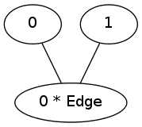
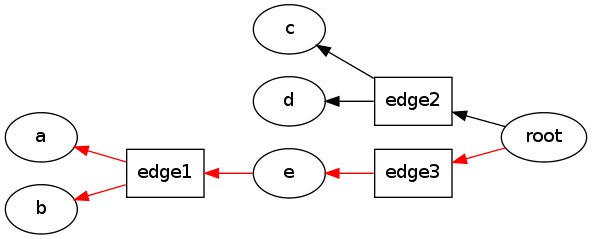

Simple Hypergraph Example
=========================

.. code:: python

    import pydecode.hyper as ph
    import pydecode.display as display
.. code:: python

    hyp = ph.Hypergraph()
    with hyp.builder() as b:
         n1 = b.add_node(label = "a")
         n2 = b.add_node(label = "b")
         n3 = b.add_node(label = "c")
         n4 = b.add_node(label = "d")
         n5 = b.add_node((([n1, n2], "edge1"),), label = "e")
         b.add_node([([n5], "edge3"), ([n3, n4], "edge2")], label = "root")
    
    def build_weights(label):
         return {"edge1" : 3, "edge2" : 1, "edge3" : 1}[label]
    weights = ph.Weights(hyp).build(build_weights)
Draw the graph

.. code:: python

    display.HypergraphWeightFormatter(hyp, weights).to_ipython()

.. code:: python

    path = ph.best_path(hyp, weights)
    display.HypergraphPathFormatter(hyp, [path]).to_ipython()

