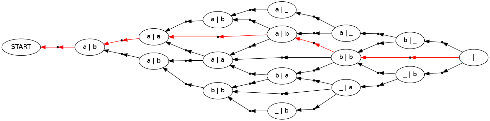

Tutorials
=========

1. :doc:`Fibonacci`

.. image:: images/Fibonacci.png
   :width: 500 px
   :align: center

|
|

2. :doc:`EditDistance`

|
|

3. :doc:`hmm`

.. image:: images/hmm.png
   :width: 500 px
   :align: center

|
|

4. :doc:`Parsing`

.. image:: images/parsing.png
   :width: 500 px
   :align: center

|
|

5. :doc:`sequence_crf`

.. More Examples
.. =============

.. `Decipherment`_

.. .. image:: images/decipher.png
..    :width: 500 px
..    :align: center

.. `Building a Hypergraph`_

..
      _Fibonacci : http://nbviewer.ipython.org/github/srush/PyDecode/blob/master/notebooks/Fibonacci.ipynb
      _`Edit Distance` : http://nbviewer.ipython.org/github/srush/PyDecode/blob/master/notebooks/EditDistance.ipynb
      _`Hidden Markov Model` : http://nbviewer.ipython.org/github/srush/PyDecode/blob/master/notebooks/hmm.ipynb
      _`Dependency Parsing` : http://nbviewer.ipython.org/github/srush/PyDecode/blob/master/notebooks/parsing.ipynb
      _`Training a Conditional Random Field` : http://nbviewer.ipython.org/github/srush/PyDecode/blob/master/notebooks/PerceptronTagger.ipynb

   .. _`Decipherment` : http://nbviewer.ipython.org/github/srush/PyDecode/blob/master/notebooks/decipher.ipynb
   .. _`Building a Hypergraph` : http://nbviewer.ipython.org/github/srush/PyDecode/blob/master/notebooks/BuildingHypergraph.ipynb

.. toctree::
   :maxdepth: 2
   :hidden:

   Fibonacci
   EditDistance
   hmm
   parsing
   sequence_crf
   .. decipher
   .. BuildingHypergraph
