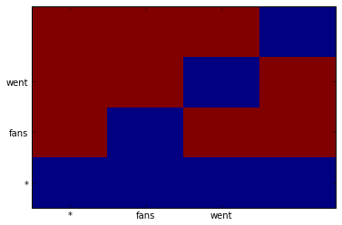

Tutorial 4: Dependency Parsing
==============================

.. code:: python

    import pydecode
    import numpy as np
    import matplotlib.pyplot as plt
.. code:: python

    kShapes = 2
    Tri = 0; Trap = 1
    kDir = 2
    Right = 0; Left = 1
.. code:: python

    def eisner_first_order(n):
        coder = np.arange((kShapes * kDir * n * n), dtype=np.int64) \
            .reshape([kShapes, kDir, n, n])
        out = np.arange(n*n, dtype=np.int64).reshape([n, n])
        chart = pydecode.ChartBuilder(coder, out)
    
        # Add terminal nodes.
        chart.init(np.diag(coder[Tri, Right]))
        chart.init(np.diag(coder[Tri, Left, 1:, 1:]))
    
        for k in range(1, n):
            for s in range(n):
                t = k + s
                if t >= n:
                    break
    
                # First create incomplete items.
                out_ind = np.zeros([t-s], dtype=np.int64)
                if s != 0:
                    out_ind.fill(out[t, s])
                    chart.set_t(coder[Trap, Left,  s,       t],
                                coder[Tri,  Right, s,       s:t],
                                coder[Tri,  Left,  s+1:t+1, t],
                                labels=out_ind)
    
                out_ind.fill(out[s, t])
                chart.set_t(coder[Trap, Right, s,       t],
                            coder[Tri,  Right, s,       s:t],
                            coder[Tri,  Left,  s+1:t+1, t],
                            labels=out_ind)
    
    
                if s != 0:
                    chart.set_t(coder[Tri,  Left,  s,   t],
                                coder[Tri,  Left,  s,   s:t],
                                coder[Trap, Left,  s:t, t])
    
                chart.set_t(coder[Tri,  Right, s,       t],
                            coder[Trap, Right, s,       s+1:t+1],
                            coder[Tri,  Right, s+1:t+1, t])
        return chart.finish()
.. code:: python

    graph = eisner_first_order(4)
.. code:: python

    def ungrid(items, shape):
        return np.array(np.unravel_index(items, shape)).T
.. code:: python

    sentence = "fans went wild"
    label_scores = np.random.random(4 * 4)
    # scores = dp.output_matrix.T * output_scores
    weights = pydecode.transform(graph, label_scores)
    path = pydecode.best_path(graph, weights)
    labels = np.array([edge.label for edge in path.edges])
    ungrid(labels[labels != -1], (4, 4))

.. parsed-literal::

    array([[0, 1],
           [3, 2],
           [0, 3]])

.. code:: python

    path = pydecode.best_path(graph, weights)
    best = weights * path.v
.. code:: python

    edge_marginals = pydecode.marginals(graph, weights)
    avg = np.sum(edge_marginals) / len(graph.edges)
    thres = 0.4 * best + 0.6 * avg
    edge_filter = np.array(edge_marginals >=thres, dtype=np.uint8)
    pruned_hyper = pydecode.filter(graph, edge_filter)
.. code:: python

    mat = pydecode.inverse_transform(graph, edge_marginals, size=(4*4))

.. parsed-literal::

    array([ -1.00000000e+09,   2.39736353e+00,   2.31316550e+00,
             2.39736353e+00,  -1.00000000e+09,  -1.00000000e+09,
             2.17027452e+00,   2.11240168e+00,  -1.00000000e+09,
             2.33194419e+00,  -1.00000000e+09,   2.27204940e+00,
            -1.00000000e+09,   2.09714112e+00,   2.39736353e+00,
            -1.00000000e+09])

.. code:: python

    mat= mat.reshape((4,4))
    plt.pcolor(mat.T)
    plt.yticks(np.arange(0.5, len(sentence.split()), 1), ["*"] + sentence.split())
    plt.xticks(np.arange(0.5, len(sentence.split()), 1), ["*"] + sentence.split())
    None

.. code:: python

    import pydecode.display
    class ParseFormat(pydecode.display.HypergraphPathFormatter):
        def graph_attrs(self):
            return {"rankdir": "TB", "clusterrank": "local"}
        def hypernode_attrs(self, vertex):
            label = self.vertex_labels[vertex.id]
            return {"image": "images/" +
                    ("triangle" if label[0] == Tri else "trap") + "-" + 
                    ("right" if label[1] == Right else "left") + ".png",
                    "labelloc": "t",
                    "shape": "rect",
                    "style" : "dashed",
                    "label": "%d-%d"%(label[2], label[3]) 
                    if label[2] != label[3] else 
                    (["*"] + sentence.split())[label[2]],
    
                    }
        def hypernode_subgraph(self, vertex):
            label = self.vertex_labels[vertex.id]
            if label[2] == label[3]:
                return [("clust_terminals", label[2] + (0.5 if label[1] == Right else 0))]
            return []
        def subgraph_format(self, subgraph):
            return {"rank": "same"}
        def hyperedge_node_attrs(self, edge):
            return {"shape": "point"}
        def hyperedge_attrs(self, edge):
            return {"arrowhead": "none", 
                    "color": "orange" if edge in self.paths[0] else "black",
                    "penwidth": 5 if edge in self.paths[0] else 1}
    
    vertex_labels = ungrid(graph.node_labeling, shape=[kShapes, kDir, 4, 4])
    pydecode.draw(graph, None, vertex_labels, paths=[path], formatter=ParseFormat())
    # ParseFormat(graph, 
    #             vertex_labels=vertex_labels).set_paths([path]).to_ipython()

.. image:: parsing_files/parsing_11_0.png

