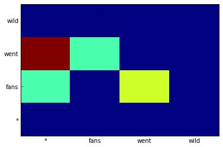
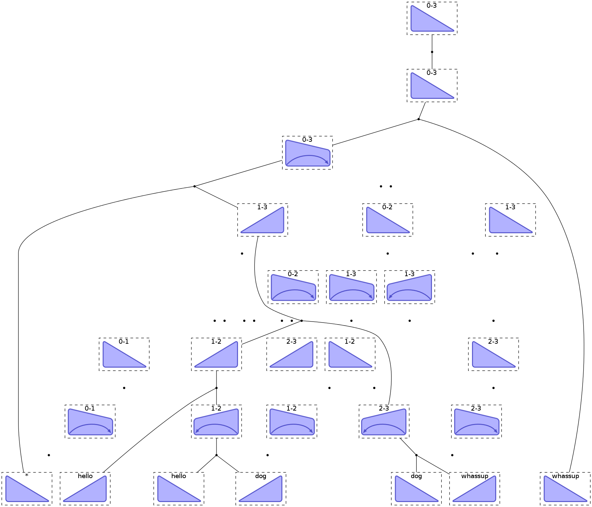

Tutorial 4: Dependency Parsing
==============================

.. code:: python

    import pydecode.hyper as ph
    import pydecode.display as display
    import numpy as np
    import numpy.random
    import pandas as pd
    random.seed(0)
.. code:: python

    Tri = 0; Trap = 1
    Right = 0; Left = 1
    
    def item_set(n):
        return ph.IndexSet((2, 2, n+1, n+1))
    
    def output_set(n):
        return ph.IndexSet((n+1, n+1))

.. code:: python

    def eisner_first_order(n):
        outputs = output_set(n)
        items = item_set(n)
        c = ph.ChartBuilder(
            output_set=outputs,
            item_set=items)
    
        # Add terminal nodes.
        for s in range(n):
            for d in [Right, Left]:
                for sh in [Tri]:
                    if s == 0 and d == Left: continue
                    c[sh, d, s, s] = c.init()
    
        for k in range(1, n):
            for s in range(n):
                t = k + s
                if t >= n: break
    
                # First create incomplete items.
                if s != 0:
                    c[Trap, Left, s, t] = \
                          [c.merge((Tri, Right, s, r), (Tri, Left, r+1, t),
                           values=[(t, s)])
                           for r in range(s, t)]
    
                c[Trap, Right, s, t] = \
                      [c.merge((Tri, Right, s, r), (Tri, Left, r+1, t),
                               values=[(s, t)])
                       for r in range(s, t)]
    
                if s != 0:
                    c[Tri, Left, s, t] = \
                        [c.merge((Tri, Left, s, r), (Trap, Left, r, t),
                                 values=[])
                         for r in range(s, t)]
    
                c[Tri, Right, s, t] = \
                      [c.merge((Trap, Right, s, r), (Tri, Right, r, t),
                               values=[])
                       for r in range(s + 1, t + 1)]
    
        return c
.. code:: python

    chart = eisner_first_order(3)
    hypergraph = chart.finish()
    output_mat = chart.matrix()
    item_mat = chart.item_matrix()
    items = item_set(3)
    outputs = output_set(3)
.. code:: python

    sentence = "fans went wild"
    potentials = np.random.random(len(hypergraph.edges))
    path = ph.best_path(hypergraph, potentials)
    best = potentials.T * path.v
    print map(outputs.element, (output_mat * path.v).nonzero()[0])

.. parsed-literal::

    [(1, 2), (0, 1)]

.. code:: python

    mat = np.reshape(output_mat *  edge_marginals, (4, 4)).T
    plt.pcolor(mat.T)
    plt.yticks(np.arange(0.5, len(df.index), 1), ["*"] + sentence.split())
    plt.xticks(np.arange(0.5, len(df.columns), 1), ["*"] + sentence.split())
    None

.. code:: python

    node_marginals, edge_marginals = ph.marginals(hypergraph, potentials)
    avg = np.sum(edge_marginals) / len(hypergraph.edges)
    thres = 0.4 * best + 0.6 * avg
    edge_filter = np.array(edge_marginals >=thres, dtype=np.int8)
    _, projection, pruned_hyper = ph.project(hypergraph, edge_filter)
    pruned_potentials = projection * potentials
.. code:: python

    class ParseFormat(display.HypergraphPathFormatter):
        def __init__(self, hypergraph, sentence, path):
            self.path = path
            self.hypergraph = hypergraph
            self.sentence = sentence
        def graph_attrs(self):
            return {"rankdir": "TB", "clusterrank": "local"}
        def hypernode_attrs(self, node):
            label = node.label
            return {"image": 
                    ("triangle" if label[0] == Tri else "trap") + "-" + 
                    ("right" if label[1] == Right else "left") + ".png",
                    "labelloc": "t",
                    "shape": "rect",
                    "style" : "dashed",
                    "label": "%d-%d"%(label[2], label[3]) 
                    if label[2] != label[3] else 
                    (["*"] + sentence.split())[label[2]],
    
                    }
        def hypernode_subgraph(self, node):
            label = node.label
            if label[2] == label[3]:
                return [("clust_terminals", label[2] + (0.5 if label[1] == Right else 0))]
            return []
        def subgraph_format(self, subgraph):
            return {"rank": "same"}
        def hyperedge_node_attrs(self, edge):
            return {"shape": "point"}
        def hyperedge_attrs(self, edge):
            return {"arrowhead": "none", 
                    "color": "orange" if edge in self.path else "black",
                    "penwidth": 5 if edge in self.path else 1}
    
    ParseFormat(hypergraph, sentence, path).to_ipython()

