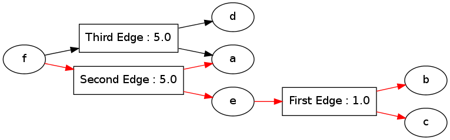

Tutorial: Edit Distance
=======================

.. code:: python

    import pydecode.hyper as ph
    import pydecode.chart as chart
    import pydecode.semiring as semi
In this tutorial, we will consider solving an edit distance problem
using PyDecode. This will provide an overview of

-  Constructing a dynamic program.
-  Assigning scores to operations.
-  Using more advanced queries.

For an overview of the edit distance problem, see the wikipedia article
on Levenshtein distance,
http://en.wikipedia.org/wiki/Levenshtein\_distance.

.. code:: python

    class State:
        def __init__(self, i, j, prob):
            self.i = i
            self.j = j
            self.prob = prob
    
        def __cmp__(self, other):
            return cmp((self.i, self.j), (other.i, other.j))
    
        def __hash__(self): return hash((self.i, self.j))
    
        def __str__(self):
            return str((self.i, self.j))
    
        def op(self, op):
            if op == Op.Ins:
                return State(self.i-1, self.j, self.prob)
            elif op == Op.Del:
                return State(self.i, self.j-1, self.prob)
            elif op == Op.Mat:
                return State(self.i-1, self.j-1, self.prob)
    
    class Op:
        def __init__(self, op):
            self.op = op
        Ins = 1 
        Del = 2 
        Mat = 3
.. code:: python

    def edit_distance(c, prob):
        c.init(State(-1, -1, prob))
        for i, s_char in enumerate(prob[0]):
            for j, t_char in enumerate(prob[1]):
                state = State(i, j, prob)
                c[state] = \
                    c.sum(( c[state.op(m)] * c.sr(m) 
                            for m in [Op.Ins, Op.Del, Op.Mat] ))
        final_state = State(len(prob[0]), len(prob[1]), prob)
        c[final_state] = c[final_state.op(Op.Mat)] * c.sr(Op.Mat)
        return c
.. code:: python

    c = chart.ChartBuilder(lambda a:True, semi.LogicSemiRing)
    c = edit_distance(c, ("aab", "bbb"))
    print c.finish()
    c.show()

.. parsed-literal::

    True
    (-1, -1) True
    (0, 0) True
    (0, 1) True
    (0, 2) True
    (1, 0) True
    (1, 1) True
    (1, 2) True
    (2, 0) True
    (2, 1) True
    (2, 2) True
    (3, 3) True

.. code:: python

    c = chart.ChartBuilder(lambda a:a, chart.HypergraphSemiRing, 
                           build_hypergraph=True, debug=Trued)
    hypergraph = edit_distance(c, ("aab", "bbb")).finish()
.. code:: python

    import pydecode.display as display
    display.HypergraphFormatter(hypergraph).to_ipython()

.. image:: tutorial_files/tutorial_7_0.png

Building a Hypergraph
---------------------

.. code:: python

    import pydecode.hyper as ph
.. code:: python

    hyper1 = ph.Hypergraph()
The main data structure provided by pydecode is a hypergraph.
Hypergraphs provide a graph-theoretical representation of dynamic
programming problems.

The code assumes that the hypergraph is immutable. The python interface
enforces this by using a builder pattern. The important function to
remember is add\_node.

-  If there no arguments, then a terminal node is created. Terminal
   nodes must be created first.
-  If it is given an iterable, it create hyperedges to the new node.
   Each element in the iterable is a pair
-  A list of tail nodes for that edge.
-  A label for that edge.

.. code:: python

    with hyper1.builder() as b:
        node_a = b.add_node(label = "a")
        node_b = b.add_node(label = "b")
        node_c = b.add_node(label = "c")
        node_d = b.add_node(label = "d")
        node_e = b.add_node([([node_b, node_c], "First Edge")], label = "e")
        b.add_node([([node_a, node_e], "Second Edge"),
                    ([node_a, node_d], "Third Edge")], label = "f")
Outside of the ``with`` block the hypergraph is considered finished and
no new nodes can be added.

We can also display the hypergraph to see our work.

.. code:: python

    import pydecode.display as display
    display.HypergraphFormatter(hyper1).to_ipython()

After creating the hypergraph we can assign additional property
information. One useful property is to add weights. We do this by
defining a function to map labels to weights.

.. code:: python

    def build_weights(label):
        if "First" in label: return 1
        if "Second" in label: return 5
        if "Third" in label: return 5
        return 0
    weights = ph.Weights(hyper1).build(build_weights)
.. code:: python

    for edge in hyper1.edges:
        print hyper1.label(edge), weights[edge]

.. parsed-literal::

    First Edge 1.0
    Second Edge 5.0
    Third Edge 5.0

We use the best path.

.. code:: python

    path = ph.best_path(hyper1, weights)
.. code:: python

    print weights.dot(path)

.. parsed-literal::

    6.0

.. code:: python

    display.HypergraphFormatter(hyper1).to_ipython()

.. image:: tutorial_files/tutorial_23_0.png

Hypergraph for Dynamic Programming
----------------------------------

The next question is how we might use this in practice.

Here is a simple dynamic programming example take from wikipedia:

::

    int LevenshteinDistance(string s, string t)
    {
      int len_s = length(s);
      int len_t = length(t);

      /* test for degenerate cases of empty strings */
      if (len_s == 0) return len_t;
      if (len_t == 0) return len_s;

      /* test if last characters of the strings match */
      if (s[len_s-1] == t[len_t-1]) cost = 0;
      else                          cost = 1;

      /* return minimum of delete char from s, delete char from t, and delete char from both */
      return minimum(LevenshteinDistance(s[0..len_s-1], t) + 1,
                     LevenshteinDistance(s, t[0..len_t-1]) + 1,
                     LevenshteinDistance(s[0..len_s-1], t[0..len_t-1]) + cost)
    }

.. code:: python

    def make_ld_hyper(s, t):
        ld_hyper = ph.Hypergraph()
        
        with ld_hyper.builder() as b:
            nodes = {}
            s2 = s + "$"
            t2 = t + "$"
            for i, s_char in enumerate(s2):
                for j, t_char in enumerate(t2):
                    edges = [([nodes[k, l]], m) 
                             for k, l, m in [(i-1, j, "<"), (i, j-1, ">"), (i-1, j-1, "m")] 
                             if k >= 0 and l >= 0
                             if m != "m" or s2[k] == t2[l]]
                    nodes[i, j] = b.add_node(edges, label=str((s2[:i], t2[:j])))
            b.add_node([([nodes[len(s2) - 1, len(t2) - 1]], "")])
        return ld_hyper
.. code:: python

    hyper2 = make_ld_hyper("ab", "bb")
    display.HypergraphFormatter(hyper2).to_ipython()

.. image:: tutorial_files/tutorial_27_0.png

.. code:: python

    def build_weights(label):
        if label in ["<", ">"]: return 0.0
        if label == "m": return 1.0
        return 0.0
    weights2 = ph.Weights(hyper2).build(build_weights)
.. code:: python

    path = ph.best_path(hyper2, weights2)
    display.HypergraphPathFormatter(hyper2, [path]).to_ipython()

::

    ---------------------------------------------------------------------------
    ValueError                                Traceback (most recent call last)

    <ipython-input-21-9d5702cb485c> in <module>()
    ----> 1 path, chart = ph.best_path(hyper2, weights2)
          2 display.HypergraphPathFormatter(hyper2, [path]).to_ipython()

    ValueError: too many values to unpack

